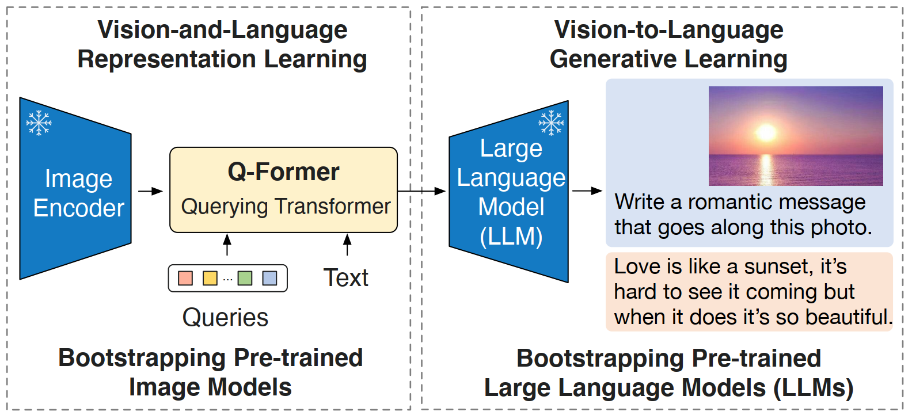
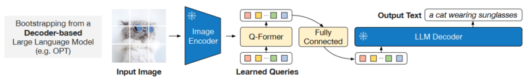

# BLIP-2: Bootstrapping Language-Image Pre-training with Frozen Image Encoders and Large Language Models



以下代码来自官方代码库[LAVIS/lavis/models/blip2_models at main · salesforce/LAVIS · GitHub](https://github.com/salesforce/LAVIS/blob/main/lavis/models/blip2_models/) 

# Blip2Base

提供了`init_tokenizer`，`init_Qformer`，`vision_encoder`等方法

```python
class Blip2Base(BaseModel):
    @classmethod
    def init_tokenizer(cls, truncation_side="right"):
        tokenizer = BertTokenizer.from_pretrained("bert-base-uncased", truncation_side=truncation_side)
        tokenizer.add_special_tokens({"bos_token": "[DEC]"})
        return tokenizer

    def maybe_autocast(self, dtype=torch.float16):
        # if on cpu, don't use autocast
        # if on gpu, use autocast with dtype if provided, otherwise use torch.float16
        enable_autocast = self.device != torch.device("cpu")

        if enable_autocast:
            return torch.cuda.amp.autocast(dtype=dtype)
        else:
            return contextlib.nullcontext()

    @classmethod
    def init_Qformer(cls, num_query_token, vision_width, cross_attention_freq=2):
        encoder_config = BertConfig.from_pretrained("bert-base-uncased")
        encoder_config.encoder_width = vision_width
        # insert cross-attention layer every other block
        encoder_config.add_cross_attention = True
        encoder_config.cross_attention_freq = cross_attention_freq
        encoder_config.query_length = num_query_token
        Qformer = BertLMHeadModel.from_pretrained(
            "bert-base-uncased", config=encoder_config
        )
        query_tokens = nn.Parameter(
            torch.zeros(1, num_query_token, encoder_config.hidden_size)
        )
        query_tokens.data.normal_(mean=0.0, std=encoder_config.initializer_range)
        return Qformer, query_tokens

    def init_vision_encoder(
        self, model_name, img_size, drop_path_rate, use_grad_checkpoint, precision
    ):
        assert model_name in [
            "eva_clip_g",
            "eva2_clip_L",
            "clip_L",
        ], "vit model must be eva_clip_g, eva2_clip_L or clip_L"
        if model_name == "eva_clip_g":
            visual_encoder = create_eva_vit_g(
                img_size, drop_path_rate, use_grad_checkpoint, precision
            )
#         elif model_name == "eva2_clip_L":
#             visual_encoder = create_eva2_vit_L(
#                 img_size, drop_path_rate, use_grad_checkpoint, precision
#             )
        elif model_name == "clip_L":
            visual_encoder = create_clip_vit_L(img_size, use_grad_checkpoint, precision)
        ln_vision = LayerNorm(visual_encoder.num_features)
        self.vit_name = model_name
        return visual_encoder, ln_vision
```

# First-stage: Qformer


一阶段训练的模型，包含三个训练损失：ITM，ITC和LM，代码来自[LAVIS/lavis/models/blip2_models/blip2_qformer.py at main · salesforce/LAVIS · GitHub](https://github.com/salesforce/LAVIS/blob/main/lavis/models/blip2_models/blip2_qformer.py)

```python
@registry.register_model("blip2")
@registry.register_model("blip2_feature_extractor")
class Blip2Qformer(Blip2Base):
    """
    BLIP2 first-stage model with Q-former and ViT.
    Supported model types:
        - pretrained: pretrained model with vit-g
        - pretrain_vitL: pretrained model with vit-large
        - coco: fintuned model on coco
    Usage:
        >>> from lavis.models import load_model
        >>> model = load_model("blip2", "pretrain")
    """

    PRETRAINED_MODEL_CONFIG_DICT = {
        "pretrain": "configs/models/blip2/blip2_pretrain.yaml",
        "pretrain_vitL": "configs/models/blip2/blip2_pretrain_vitL.yaml",
        "coco": "configs/models/blip2/blip2_coco.yaml",
    }

    def __init__(
        self,
        vit_model="eva_clip_g",
        img_size=224,
        drop_path_rate=0,
        use_grad_checkpoint=False,
        vit_precision="fp16",
        freeze_vit=True,
        num_query_token=32,
        cross_attention_freq=2,
        embed_dim=256,
        max_txt_len=32,
    ):
        super().__init__()

        self.tokenizer = self.init_tokenizer()

        self.visual_encoder, self.ln_vision = self.init_vision_encoder(
            vit_model, img_size, drop_path_rate, use_grad_checkpoint, vit_precision
        )
        if freeze_vit:
            for name, param in self.visual_encoder.named_parameters():
                param.requires_grad = False
            self.visual_encoder = self.visual_encoder.eval()
            self.visual_encoder.train = disabled_train
            logging.info("freeze vision encoder")
        self.Qformer, self.query_tokens = self.init_Qformer(
            num_query_token, self.visual_encoder.num_features, cross_attention_freq
        )
        self.Qformer.resize_token_embeddings(len(self.tokenizer))
        state_dict = self.Qformer.state_dict()
        for name, param in self.Qformer.named_parameters():
            if "_query" in name:
                key_orig = name.replace("_query", "")
                param.data.copy_(state_dict[key_orig])

        self.vision_proj = nn.Linear(self.Qformer.config.hidden_size, embed_dim)
        self.text_proj = nn.Linear(self.Qformer.config.hidden_size, embed_dim)

        self.itm_head = nn.Linear(self.Qformer.config.hidden_size, 2)

        self.temp = nn.Parameter(0.07 * torch.ones([]))

        self.max_txt_len = max_txt_len

    def forward(self, samples):
        image = samples["image"]
        text = samples["text_input"]

        image_embeds = self.ln_vision(self.visual_encoder(image))
        image_atts = torch.ones(image_embeds.size()[:-1], dtype=torch.long).to(
            image.device
        )

        query_tokens = self.query_tokens.expand(image_embeds.shape[0], -1, -1)

        query_output = self.Qformer.bert(
            query_embeds=query_tokens,
            encoder_hidden_states=image_embeds,
            encoder_attention_mask=image_atts,
            use_cache=True,
            return_dict=True,
        )

        image_feats = F.normalize(
            self.vision_proj(query_output.last_hidden_state), dim=-1
        )

        text_tokens = self.tokenizer(
            text,
            padding="max_length",
            truncation=True,
            max_length=self.max_txt_len,
            return_tensors="pt",
        ).to(image.device)
        text_output = self.Qformer.bert(
            text_tokens.input_ids,
            attention_mask=text_tokens.attention_mask,
            return_dict=True,
        )
        text_feat = F.normalize(
            self.text_proj(text_output.last_hidden_state[:, 0, :]), dim=-1
        )

        ###============== Image-text Contrastive ===================###
        image_feats_all = concat_all_gather(
            image_feats
        )  # [batch_size*num_gpu, num_query_tokens, embed_dim]
        text_feat_all = concat_all_gather(text_feat)  # [batch_size*num_gpu, embed_dim]

        sim_q2t = torch.matmul(
            image_feats.unsqueeze(1), text_feat_all.unsqueeze(-1)
        ).squeeze()
        # [batch_size, batch_size*num_gpu, num_query_tokens]

        # image-text similarity: aggregate across all query tokens
        sim_i2t, _ = sim_q2t.max(-1)
        sim_i2t = sim_i2t / self.temp

        # text-query similarity: [batch_size, batch_size*num_gpu, num_query_tokens]
        sim_t2q = torch.matmul(
            text_feat.unsqueeze(1).unsqueeze(1), image_feats_all.permute(0, 2, 1)
        ).squeeze()

        # text-image similarity: aggregate across all query tokens
        sim_t2i, _ = sim_t2q.max(-1)
        sim_t2i = sim_t2i / self.temp  # [batch_size, batch_size*num_gpu]

        rank = dist.get_rank()
        bs = image.size(0)
        targets = torch.linspace(rank * bs, rank * bs + bs - 1, bs, dtype=int).to(
            image.device
        )

        if "image_id" in samples.keys(): #coco retrieval finetuning
            image_ids = samples["image_id"].view(-1,1)
            image_ids_all = concat_all_gather(image_ids)
            pos_idx = torch.eq(image_ids, image_ids_all.t()).float()       
            sim_targets = pos_idx / pos_idx.sum(1,keepdim=True)   
            sim_targets = 0.9 * sim_targets + 0.1 * torch.ones_like(sim_targets) / sim_targets.size(1)

            loss_t2i = -torch.sum(F.log_softmax(sim_t2i, dim=1)*sim_targets,dim=1).mean()
            loss_i2t = -torch.sum(F.log_softmax(sim_i2t, dim=1)*sim_targets,dim=1).mean()     
            loss_itc = (loss_t2i+loss_i2t)/2  
        else:                     
            loss_itc = (
                F.cross_entropy(sim_i2t, targets, label_smoothing=0.1)
                + F.cross_entropy(sim_t2i, targets, label_smoothing=0.1)
            ) / 2

        ###============== Image-text Matching ===================###
        text_input_ids_world = concat_all_gather(text_tokens.input_ids)
        text_attention_mask_world = concat_all_gather(text_tokens.attention_mask)
        image_embeds_world = all_gather_with_grad(image_embeds)
        with torch.no_grad():
            if "image_id" in samples.keys():
                mask = torch.eq(image_ids, image_ids_all.t())
                sim_t2i.masked_fill_(mask, -10000)
                sim_i2t.masked_fill_(mask, -10000)
            else:    
                sim_t2i[:, rank * bs : rank * bs + bs].fill_diagonal_(-10000)
                sim_i2t[:, rank * bs : rank * bs + bs].fill_diagonal_(-10000)            

            weights_t2i = F.softmax(sim_t2i, dim=1)
            weights_i2t = F.softmax(sim_i2t, dim=1)

        # select a negative image for each text
        image_embeds_neg = []
        for b in range(bs):
            neg_idx = torch.multinomial(weights_t2i[b], 1).item()
            image_embeds_neg.append(image_embeds_world[neg_idx])
        image_embeds_neg = torch.stack(image_embeds_neg, dim=0)

        # select a negative text for each image
        text_ids_neg = []
        text_atts_neg = []
        for b in range(bs):
            neg_idx = torch.multinomial(weights_i2t[b], 1).item()
            text_ids_neg.append(text_input_ids_world[neg_idx])
            text_atts_neg.append(text_attention_mask_world[neg_idx])

        text_ids_neg = torch.stack(text_ids_neg, dim=0)
        text_atts_neg = torch.stack(text_atts_neg, dim=0)

        text_ids_all = torch.cat(
            [text_tokens.input_ids, text_tokens.input_ids, text_ids_neg], dim=0
        )  # pos, pos, neg
        text_atts_all = torch.cat(
            [text_tokens.attention_mask, text_tokens.attention_mask, text_atts_neg],
            dim=0,
        )

        query_tokens_itm = self.query_tokens.expand(text_ids_all.shape[0], -1, -1)
        query_atts_itm = torch.ones(query_tokens_itm.size()[:-1], dtype=torch.long).to(
            image.device
        )
        attention_mask_all = torch.cat([query_atts_itm, text_atts_all], dim=1)

        image_embeds_all = torch.cat(
            [image_embeds, image_embeds_neg, image_embeds], dim=0
        )  # pos, neg, pos
        image_atts_all = torch.ones(image_embeds_all.size()[:-1], dtype=torch.long).to(
            image.device
        )

        output_itm = self.Qformer.bert(
            text_ids_all,
            query_embeds=query_tokens_itm,
            attention_mask=attention_mask_all,
            encoder_hidden_states=image_embeds_all,
            encoder_attention_mask=image_atts_all,
            return_dict=True,
        )

        vl_embeddings = output_itm.last_hidden_state[:, : query_tokens_itm.size(1), :]
        vl_output = self.itm_head(vl_embeddings)
        logits = vl_output.mean(dim=1)

        itm_labels = torch.cat(
            [torch.ones(bs, dtype=torch.long), torch.zeros(2 * bs, dtype=torch.long)],
            dim=0,
        ).to(image.device)
        loss_itm = F.cross_entropy(logits, itm_labels)

        ##================= Image Captioning ========================##
        decoder_input_ids = text_tokens.input_ids.clone()
        decoder_input_ids[:, 0] = self.tokenizer.bos_token_id
        labels = decoder_input_ids.masked_fill(
            decoder_input_ids == self.tokenizer.pad_token_id, -100
        )

        query_atts = torch.ones(query_tokens.size()[:-1], dtype=torch.long).to(
            image.device
        )
        attention_mask = torch.cat([query_atts, text_tokens.attention_mask], dim=1)
        lm_output = self.Qformer(
            decoder_input_ids,
            attention_mask=attention_mask,
            past_key_values=query_output.past_key_values,
            return_dict=True,
            labels=labels,
        )

        loss_lm = lm_output.loss

        return BlipOutput(
            loss=loss_itc + loss_itm + loss_lm,
            loss_itc=loss_itc,
            loss_itm=loss_itm,
            loss_lm=loss_lm,
        )

    @torch.no_grad()
    def generate(
        self,
        samples,
        use_nucleus_sampling=False,
        num_beams=3,
        max_length=30,
        min_length=10,
        top_p=0.9,
        repetition_penalty=1.0,
    ):
        """
        Args:
            samples (dict): A dictionary containing the following keys:
                - image (torch.Tensor): A tensor of shape (batch_size, 3, H, W)
            use_nucleus_sampling (bool): Whether to use nucleus sampling. If False, use top-k sampling.
            num_beams (int): Number of beams for beam search. 1 means no beam search.
            max_length (int): The maximum length of the sequence to be generated.
            min_length (int): The minimum length of the sequence to be generated.
            top_p (float): The cumulative probability for nucleus sampling.
            repetition_penalty (float): The parameter for repetition penalty. 1.0 means no penalty.
            num_captions (int): Number of captions to be generated for each image.
        Returns:
            captions (list): A list of strings of length batch_size * num_captions.
        """
        image = samples["image"]
        image_embeds = self.ln_vision(self.visual_encoder(image))

        if not use_nucleus_sampling:
            image_embeds = image_embeds.repeat_interleave(num_beams, dim=0)
        else:
            num_beams = 1
        image_atts = torch.ones(image_embeds.size()[:-1], dtype=torch.long).to(
            image.device
        )

        model_kwargs = {
            "encoder_hidden_states": image_embeds,
            "encoder_attention_mask": image_atts,
        }

        input_ids = (
            torch.LongTensor(image.size(0), 1)
            .fill_(self.tokenizer.bos_token_id)
            .to(image.device)
        )
        query_tokens = self.query_tokens.expand(image_embeds.shape[0], -1, -1)

        outputs = self.Qformer.generate(
            input_ids=input_ids,
            query_embeds=query_tokens,
            max_length=max_length,
            min_length=min_length,
            num_beams=num_beams,
            do_sample=use_nucleus_sampling,
            top_p=top_p,
            eos_token_id=self.tokenizer.sep_token_id,
            pad_token_id=self.tokenizer.pad_token_id,
            **model_kwargs
        )
        captions = self.tokenizer.batch_decode(outputs, skip_special_tokens=True)
        return captions

    def forward_image(self, image):
        image_embeds = self.ln_vision(self.visual_encoder(image))
        image_atts = torch.ones(image_embeds.size()[:-1], dtype=torch.long).to(
            image.device
        )

        query_tokens = self.query_tokens.expand(image_embeds.shape[0], -1, -1)

        query_output = self.Qformer.bert(
            query_embeds=query_tokens,
            encoder_hidden_states=image_embeds,
            encoder_attention_mask=image_atts,
            return_dict=True,
        )
        return query_output.last_hidden_state, image_embeds

    def forward_text(self, text_tokens):
        text_output = self.Qformer.bert(
            text_tokens.input_ids,
            attention_mask=text_tokens.attention_mask,
            return_dict=True,
        )
        return text_output.last_hidden_state[:, 0, :]

    def compute_itm(self, image_inputs, text_ids, text_atts):
        image_atts = torch.ones(image_inputs.size()[:-1], dtype=torch.long).to(
            image_inputs.device
        )
        query_tokens = self.query_tokens.expand(image_inputs.shape[0], -1, -1)
        query_atts = torch.ones(query_tokens.size()[:-1], dtype=torch.long).to(
            image_inputs.device
        )
        attention_mask = torch.cat([query_atts, text_atts], dim=1)
        output_itm = self.Qformer.bert(
            text_ids,
            query_embeds=query_tokens,
            attention_mask=attention_mask,
            encoder_hidden_states=image_inputs,
            encoder_attention_mask=image_atts,
            return_dict=True,
        )
        vl_embeddings = output_itm.last_hidden_state[:, : query_tokens.size(1), :]
        itm_logit = self.itm_head(vl_embeddings)
        itm_logit = itm_logit[:, :, 1].mean(dim=1)
        return itm_logit

    @torch.no_grad()
    def extract_features(self, samples, mode="multimodal"):
        """
        Extract features for multimodal or unimodal samples.
        Args:
            samples (dict): A dictionary of samples, containing the following keys:
                - image (torch.Tensor): A tensor of shape (B, C, H, W) containing the image.
                    Raw images should be preprocessed before being passed to feature extractor.
                - text_input (list): A list of strings containing the text, length B.
            mode (str): The mode of feature extraction. Can be either "multimodal", "text" or "image".
                If "multimodal", return image features and multimodal features;
                if "text", return text features;
                if "image", return image features.
                Default: "multimodal".
        Returns:
            BlipOutputFeatures: A BlipOutputFeatures object containing the features.
                See lavis/models/blip_models/blip_outputs.py for more details.
        """
        image = samples.get("image")
        caption = samples.get("text_input")

        # assert mode is one of "image", "text", "multimodal"
        assert mode in [
            "image",
            "text",
            "multimodal",
        ], "mode must be one of 'image', 'text', 'multimodal'"

        # initalize output
        image_embeds, text_embeds, multimodal_embeds = None, None, None
        image_features, text_features = None, None

        if mode == "image":
            assert (
                image is not None
            ), "Image is not provided for mode 'image' or 'multimodal'"
            # return query features
            with self.maybe_autocast():
                image_embeds_frozen = self.ln_vision(self.visual_encoder(image))
            image_embeds_frozen = image_embeds_frozen.float()
            image_atts = torch.ones(
                image_embeds_frozen.size()[:-1], dtype=torch.long
            ).to(self.device)
            query_tokens = self.query_tokens.expand(
                image_embeds_frozen.shape[0], -1, -1
            )

            query_output = self.Qformer.bert(
                query_embeds=query_tokens,
                encoder_hidden_states=image_embeds_frozen,
                encoder_attention_mask=image_atts,
                return_dict=True,
            )
            image_embeds = query_output.last_hidden_state
            image_features = F.normalize(self.vision_proj(image_embeds), dim=-1)

        elif mode == "text":
            assert (
                caption is not None
            ), "text input is None for mode 'text' or 'multimodal'"

            # return text features
            text = self.tokenizer(caption, return_tensors="pt", padding=True).to(
                self.device
            )

            text_output = self.Qformer.bert(
                text.input_ids,
                attention_mask=text.attention_mask,
                return_dict=True,
            )
            text_embeds = text_output.last_hidden_state
            text_features = self.text_proj(text_embeds)
            text_features = F.normalize(text_features, dim=-1)

        elif mode == "multimodal":
            # return multimodel query features
            with self.maybe_autocast():
                image_embeds_frozen = self.ln_vision(self.visual_encoder(image))
            image_embeds_frozen = image_embeds_frozen.float()
            image_atts = torch.ones(
                image_embeds_frozen.size()[:-1], dtype=torch.long
            ).to(self.device)
            query_tokens = self.query_tokens.expand(
                image_embeds_frozen.shape[0], -1, -1
            )
            query_atts = torch.ones(query_tokens.size()[:-1], dtype=torch.long).to(
                self.device
            )

            text = self.tokenizer(caption, return_tensors="pt", padding=True).to(
                self.device
            )
            attention_mask = torch.cat([query_atts, text.attention_mask], dim=1)

            output = self.Qformer.bert(
                text.input_ids,
                query_embeds=query_tokens,
                attention_mask=attention_mask,
                encoder_hidden_states=image_embeds_frozen,
                encoder_attention_mask=image_atts,
                return_dict=True,
            )

            multimodal_embeds = output.last_hidden_state[:, : query_tokens.size(1), :]

        return BlipOutputFeatures(
            image_embeds=image_embeds,
            image_embeds_proj=image_features,
            text_embeds=text_embeds,
            text_embeds_proj=text_features,
            multimodal_embeds=multimodal_embeds,
        )

    @classmethod
    def from_config(cls, cfg):
        vit_model = cfg.get("vit_model", "eva_clip_g")
        img_size = cfg.get("image_size")
        num_query_token = cfg.get("num_query_token")
        cross_attention_freq = cfg.get("cross_attention_freq", 2)

        drop_path_rate = cfg.get("drop_path_rate", 0)
        use_grad_checkpoint = cfg.get("use_grad_checkpoint", False)
        vit_precision = cfg.get("vit_precision", "fp16")
        freeze_vit = cfg.get("freeze_vit", True)

        max_txt_len = cfg.get("max_txt_len", 32)

        model = cls(
            vit_model=vit_model,
            img_size=img_size,
            drop_path_rate=drop_path_rate,
            use_grad_checkpoint=use_grad_checkpoint,
            vit_precision=vit_precision,
            freeze_vit=freeze_vit,
            num_query_token=num_query_token,
            cross_attention_freq=cross_attention_freq,
            max_txt_len=max_txt_len,
        )
        model.load_checkpoint_from_config(cfg)

        return model

    def compute_sim_matrix(self, data_loader, task_cfg):
        """
        Compute similarity i2t, t2i matrix for the given data loader.
        """
        k_test = task_cfg.k_test

        return compute_sim_matrix(model=self, data_loader=data_loader, k_test=k_test)
```

# BLIP Image-Text Matching (ITM) model

[LAVIS/lavis/models/blip2_models/blip2_image_text_matching.py at main · salesforce/LAVIS · GitHub](https://github.com/salesforce/LAVIS/blob/main/lavis/models/blip2_models/blip2_image_text_matching.py)

继承自`Blip2Qforme`，重写了`forward`方法，只保留了**ITM&ITC**部分，用于推理图文匹配

```python
@registry.register_model("blip2_image_text_matching")
class Blip2ITM(Blip2Qformer):
    """
    BLIP Image-Text Matching (ITM) model.
    Supported model types:
        - pretrained: pretrained model
        - coco: fintuned model on coco
    Usage:
        >>> from lavis.models import load_model
        >>> model = load_model("blip2_image_text_matching", "pretrained")
        >>> model = load_model("blip2_image_text_matching", "coco")
    """

    def __init__(
        self,
        vit_model="eva_clip_g",
        img_size=224,
        drop_path_rate=0,
        use_grad_checkpoint=False,
        vit_precision="fp16",
        freeze_vit=True,
        num_query_token=32,
        cross_attention_freq=2,
        embed_dim=256,
        max_txt_len=32,
    ):
        super().__init__(
            vit_model=vit_model,
            img_size=img_size,
            drop_path_rate=drop_path_rate,
            use_grad_checkpoint=use_grad_checkpoint,
            vit_precision=vit_precision,
            freeze_vit=freeze_vit,
            num_query_token=num_query_token,
            cross_attention_freq=cross_attention_freq,
            embed_dim=embed_dim,
            max_txt_len=max_txt_len,
        )

    def forward(self, samples, match_head="itm"):
        image = samples["image"]
        caption = samples["text_input"]

        with self.maybe_autocast():
            image_embeds = self.ln_vision(self.visual_encoder(image))
        image_embeds = image_embeds.float()
        image_atts = torch.ones(image_embeds.size()[:-1], dtype=torch.long).to(
            image.device
        )

        text = self.tokenizer(
            caption,
            truncation=True,
            max_length=self.max_txt_len,
            return_tensors="pt",
        ).to(image.device)

        if match_head == "itm":
            query_tokens = self.query_tokens.expand(image_embeds.shape[0], -1, -1)
            query_atts = torch.ones(query_tokens.size()[:-1], dtype=torch.long).to(
                image.device
            )
            attention_mask = torch.cat([query_atts, text.attention_mask], dim=1)
            output_itm = self.Qformer.bert(
                text.input_ids,
                query_embeds=query_tokens,
                attention_mask=attention_mask,
                encoder_hidden_states=image_embeds,
                encoder_attention_mask=image_atts,
                return_dict=True,
            )
            itm_embeddings = output_itm.last_hidden_state[:, : query_tokens.size(1), :]
            itm_logit = self.itm_head(itm_embeddings)
            itm_logit = itm_logit.mean(dim=1)

            return itm_logit

        elif match_head == "itc":
            query_tokens = self.query_tokens.expand(image_embeds.shape[0], -1, -1)

            query_output = self.Qformer.bert(
                query_embeds=query_tokens,
                encoder_hidden_states=image_embeds,
                encoder_attention_mask=image_atts,
                return_dict=True,
            )
            image_feats = F.normalize(
                self.vision_proj(query_output.last_hidden_state), dim=-1
            )

            text_output = self.Qformer.bert(
                text.input_ids,
                attention_mask=text.attention_mask,
                return_dict=True,
            )
            text_feat = F.normalize(
                self.text_proj(text_output.last_hidden_state[:, 0, :]), dim=-1
            )

            sims = torch.bmm(image_feats, text_feat.unsqueeze(-1))
            sim, _ = torch.max(sims, dim=1)

            return sim
```

# Decoder-based Bootstrapping: BLIP2 OPT model

  

[LAVIS/lavis/models/blip2_models/blip2_opt.py at main · salesforce/LAVIS · GitHub](https://github.com/salesforce/LAVIS/blob/main/lavis/models/blip2_models/blip2_opt.py)

用于第二阶段Bootstrapping，继承自`Blip2Base`

```python
@registry.register_model("blip2_opt")
class Blip2OPT(Blip2Base):
    """
    BLIP2 OPT modhttps://github.com/salesforce/LAVIS/blob/main/lavis/models/blip2_models/blip2_opt.pyel.
    Supported model types:
        - pretrained_opt2.7b: pretrained model with OPT2.7b
        - pretrained_opt6.7b: pretrained model with OPT6.7b
        - caption_coco_opt2.7b: fintuned image captioning model with OPT2.7b
        - caption_coco_opt6.7b: fintuned image captioning model with OPT6.7b
    Usage:
        >>> from lavis.models import load_model
        >>> model = load_model("blip2_opt", "caption_coco_opt2.7b")
    """

    PRETRAINED_MODEL_CONFIG_DICT = {
        "pretrain_opt2.7b": "configs/models/blip2/blip2_pretrain_opt2.7b.yaml",
        "pretrain_opt6.7b": "configs/models/blip2/blip2_pretrain_opt6.7b.yaml",
        "caption_coco_opt2.7b": "configs/models/blip2/blip2_caption_opt2.7b.yaml",
        "caption_coco_opt6.7b": "configs/models/blip2/blip2_caption_opt6.7b.yaml",
    }

    def __init__(
        self,
        vit_model="eva_clip_g",
        img_size=224,
        drop_path_rate=0,
        use_grad_checkpoint=False,
        vit_precision="fp16",
        freeze_vit=True,
        num_query_token=32,
        opt_model="facebook/opt-2.7b",
        prompt="",
        max_txt_len=32,
        apply_lemmatizer=False,
    ):
        """
        apply_lemmatizer: when set to True, postprocess predict_answers() result with lemmas.
        """
        super().__init__()
        transformers_version = version.parse(transformers.__version__)
        assert transformers_version >= version.parse("4.27"), "BLIP-2 OPT requires transformers>=4.27"

        self.tokenizer = self.init_tokenizer()

        self.visual_encoder, self.ln_vision = self.init_vision_encoder(
            vit_model, img_size, drop_path_rate, use_grad_checkpoint, vit_precision
        )
        if freeze_vit:
            for name, param in self.visual_encoder.named_parameters():
                param.requires_grad = False
            self.visual_encoder = self.visual_encoder.eval()
            self.visual_encoder.train = disabled_train
            logging.info("freeze vision encoder")

        self.Qformer, self.query_tokens = self.init_Qformer(
            num_query_token, self.visual_encoder.num_features
        )
        self.Qformer.cls = None
        self.Qformer.bert.embeddings.word_embeddings = None
        self.Qformer.bert.embeddings.position_embeddings = None
        for layer in self.Qformer.bert.encoder.layer:
            layer.output = None
            layer.intermediate = None

        self.opt_tokenizer = AutoTokenizer.from_pretrained(opt_model, use_fast=False)
        self.opt_model = OPTForCausalLM.from_pretrained(
            opt_model, torch_dtype=torch.float16
        )
        for name, param in self.opt_model.named_parameters():
            param.requires_grad = False
        self.eos_token_id = self.opt_tokenizer(
            "\n", add_special_tokens=False
        ).input_ids[0]

        self.opt_proj = nn.Linear(
            self.Qformer.config.hidden_size, self.opt_model.config.hidden_size
        )

        self.max_txt_len = max_txt_len
        self.prompt = prompt
        prompt_tokens = self.opt_tokenizer(self.prompt, return_tensors="pt")
        self.prompt_length = prompt_tokens.attention_mask.sum(1)

        self._apply_lemmatizer = apply_lemmatizer
        self._lemmatizer = None       

    def forward(self, samples):
        image = samples["image"]
        with self.maybe_autocast():
            image_embeds = self.ln_vision(self.visual_encoder(image))
        image_atts = torch.ones(image_embeds.size()[:-1], dtype=torch.long).to(
            image.device
        )

        query_tokens = self.query_tokens.expand(image_embeds.shape[0], -1, -1)
        query_output = self.Qformer.bert(
            query_embeds=query_tokens,
            encoder_hidden_states=image_embeds,
            encoder_attention_mask=image_atts,
            return_dict=True,
        )

        inputs_opt = self.opt_proj(query_output.last_hidden_state)
        atts_opt = torch.ones(inputs_opt.size()[:-1], dtype=torch.long).to(image.device)

        self.opt_tokenizer.padding_side = "right"

        text = [t + "\n" for t in samples["text_input"]]

        opt_tokens = self.opt_tokenizer(
            text,
            return_tensors="pt",
            padding="longest",
            truncation=True,
            max_length=self.max_txt_len,
        ).to(image.device)

        targets = opt_tokens.input_ids.masked_fill(
            opt_tokens.input_ids == self.opt_tokenizer.pad_token_id, -100
        )
        if self.prompt:
            targets[:, : self.prompt_length] = -100  # do not apply loss to the prompt

        empty_targets = (
            torch.ones(atts_opt.size(), dtype=torch.long).to(image.device).fill_(-100)
        )
        targets = torch.cat([empty_targets, targets], dim=1)

        inputs_embeds = self.opt_model.model.decoder.embed_tokens(opt_tokens.input_ids)
        inputs_embeds = torch.cat([inputs_opt, inputs_embeds], dim=1)
        attention_mask = torch.cat([atts_opt, opt_tokens.attention_mask], dim=1)

        with self.maybe_autocast():
            outputs = self.opt_model(
                inputs_embeds=inputs_embeds,
                attention_mask=attention_mask,
                return_dict=True,
                labels=targets,
            )
        loss = outputs.loss

        return {"loss": loss}

    @torch.no_grad()
    def generate(
        self,
        samples,
        use_nucleus_sampling=False,
        num_beams=5,
        max_length=30,
        min_length=1,
        top_p=0.9,
        repetition_penalty=1.0,
        length_penalty=1.0,
        num_captions=1,
        temperature=1,
    ):
        """
        Args:
            samples (dict): A dictionary containing the following keys:
                - image (torch.Tensor): A tensor of shape (batch_size, 3, H, W)
            use_nucleus_sampling (bool): Whether to use nucleus sampling. If False, use top-k sampling.
            num_beams (int): Number of beams for beam search. 1 means no beam search.
            max_length (int): The maximum length of the sequence to be generated.
            min_length (int): The minimum length of the sequence to be generated.
            top_p (float): The cumulative probability for nucleus sampling.
            repetition_penalty (float): The parameter for repetition penalty. 1.0 means no penalty.
            num_captions (int): Number of captions to be generated for each image.
        Returns:
            captions (list): A list of strings of length batch_size * num_captions.
        """
        image = samples["image"]
        with self.maybe_autocast():
            image_embeds = self.ln_vision(self.visual_encoder(image))
            image_atts = torch.ones(image_embeds.size()[:-1], dtype=torch.long).to(
                image.device
            )

            query_tokens = self.query_tokens.expand(image_embeds.shape[0], -1, -1)
            query_output = self.Qformer.bert(
                query_embeds=query_tokens,
                encoder_hidden_states=image_embeds,
                encoder_attention_mask=image_atts,
                return_dict=True,
            )

            inputs_opt = self.opt_proj(query_output.last_hidden_state)
            atts_opt = torch.ones(inputs_opt.size()[:-1], dtype=torch.long).to(
                image.device
            )

            if "prompt" in samples.keys():
                prompt = samples["prompt"]
            else:
                prompt = self.prompt

            prompt = [prompt] * image.size(0)

            opt_tokens = self.opt_tokenizer(
                prompt,
                return_tensors="pt",
                padding="longest",
                truncation=True,
                max_length=self.max_txt_len,
            ).to(image.device)
            attention_mask = torch.cat([atts_opt, opt_tokens.attention_mask], dim=1)

            # new version for transformers>=4.27
            inputs_embeds = self.opt_model.get_input_embeddings()(opt_tokens.input_ids)
            inputs_embeds = torch.cat([inputs_opt,inputs_embeds],dim=1)

            outputs = self.opt_model.generate(
                inputs_embeds=inputs_embeds, 
                attention_mask=attention_mask,
                do_sample=use_nucleus_sampling,
                top_p=top_p,
                temperature=temperature,
                num_beams=num_beams,
                max_length=max_length,
                min_length=min_length,
                eos_token_id=self.eos_token_id,
                repetition_penalty=repetition_penalty,
                length_penalty=length_penalty,
                num_return_sequences=num_captions,
            )
            output_text = self.opt_tokenizer.batch_decode(
                outputs, skip_special_tokens=True
            )

            # previous version for transformers<4.27
            # if use_nucleus_sampling:
            #     query_embeds = inputs_opt.repeat_interleave(num_captions, dim=0)
            #     num_beams = 1
            # else:
            #     query_embeds = inputs_opt.repeat_interleave(num_beams, dim=0)

            # outputs = self.opt_model.generate(
            #     input_ids=input_ids,
            #     query_embeds=query_embeds,
            #     attention_mask=attention_mask,
            #     do_sample=use_nucleus_sampling,
            #     top_p=top_p,
            #     temperature=temperature,
            #     num_beams=num_beams,
            #     max_new_tokens=max_length,
            #     min_length=min_length,
            #     eos_token_id=self.eos_token_id,
            #     repetition_penalty=repetition_penalty,
            #     length_penalty=length_penalty,
            #     num_return_sequences=num_captions,
            # )

            # prompt_length = opt_tokens.input_ids.shape[1]
            # output_text = self.opt_tokenizer.batch_decode(
            #     outputs[:, prompt_length:], skip_special_tokens=True
            # )

            output_text = [text.strip() for text in output_text]
            return output_text


    def predict_answers(
        self,
        samples,
        num_beams=5,
        inference_method="generate",
        max_len=10,
        min_len=1,
        num_ans_candidates=128,
        answer_list=None,
        prompt="",
        length_penalty=0,
        **kwargs
    ):
        image = samples["image"]
        with self.maybe_autocast():
            image_embeds = self.ln_vision(self.visual_encoder(image))
            image_atts = torch.ones(image_embeds.size()[:-1], dtype=torch.long).to(
                image.device
            )

            query_tokens = self.query_tokens.expand(image_embeds.shape[0], -1, -1)
            query_output = self.Qformer.bert(
                query_embeds=query_tokens,
                encoder_hidden_states=image_embeds,
                encoder_attention_mask=image_atts,
                return_dict=True,
            )

            inputs_opt = self.opt_proj(query_output.last_hidden_state)
            atts_opt = torch.ones(inputs_opt.size()[:-1], dtype=torch.long).to(
                image.device
            )

            if isinstance(samples["text_input"], str):
                samples["text_input"] = [samples["text_input"]]
            if prompt:
                text_input = [prompt.format(question) for question in samples["text_input"]]
            else:
                text_input = samples["text_input"]

            self.opt_tokenizer.padding_side = "left"
            opt_tokens = self.opt_tokenizer(
                text_input,
                return_tensors="pt",
                padding="longest",
                truncation=True,
                max_length=self.max_txt_len,
            ).to(image.device)

            attention_mask = torch.cat([atts_opt, opt_tokens.attention_mask], dim=1)

            # require transformers>=4.27
            inputs_embeds = self.opt_model.get_input_embeddings()(opt_tokens.input_ids)
            inputs_embeds = torch.cat([inputs_opt,inputs_embeds],dim=1)

            outputs = self.opt_model.generate(
                inputs_embeds=inputs_embeds,
                attention_mask=attention_mask,
                do_sample=False,
                num_beams=num_beams,
                max_new_tokens=max_len,
                min_length=min_len,
                eos_token_id=self.eos_token_id,
                length_penalty=length_penalty,
            )
            output_text = self.opt_tokenizer.batch_decode(
                outputs, skip_special_tokens=True
            )
            output_text = [text.strip() for text in output_text]
        if self._apply_lemmatizer or ("apply_lemmatizer" in samples.keys() and samples["apply_lemmatizer"]):
            output_text = self._lemmatize(output_text)

        return output_text

    def _lemmatize(self, answers):
        def apply(answer):
            doc = self.lemmatizer(answer)

            words = []
            for token in doc:
                if token.pos_ in ["NOUN", "VERB"]:
                    words.append(token.lemma_)
                else:
                    words.append(token.text)
            answer = " ".join(words)

            return answer

        return [apply(answer) for answer in answers]

    @property
    def lemmatizer(self):
        if self._lemmatizer is None:
            try:
                import spacy

                self._lemmatizer = spacy.load("en_core_web_sm")
            except ImportError:
                logging.error(
                    """
                    Please install spacy and en_core_web_sm model to apply lemmatization.
                    python -m spacy download en_core_web_sm
                    OR
                    import spacy.cli
                    spacy.cli.download("en_core_web_sm")
                    """
                )
                exit(1)

        return self._lemmatizer

    @classmethod
    def from_config(cls, cfg):
        vit_model = cfg.get("vit_model", "eva_clip_g")
        img_size = cfg.get("image_size")
        num_query_token = cfg.get("num_query_token")
        opt_model = cfg.get("opt_model")

        drop_path_rate = cfg.get("drop_path_rate", 0)
        use_grad_checkpoint = cfg.get("use_grad_checkpoint", False)
        vit_precision = cfg.get("vit_precision", "fp16")
        freeze_vit = cfg.get("freeze_vit", True)

        prompt = cfg.get("prompt", "")
        max_txt_len = cfg.get("max_txt_len", 32)

        apply_lemmatizer = cfg.get("apply_lemmatizer", False)

        model = cls(
            vit_model=vit_model,
            img_size=img_size,
            drop_path_rate=drop_path_rate,
            use_grad_checkpoint=use_grad_checkpoint,
            vit_precision=vit_precision,
            freeze_vit=freeze_vit,
            num_query_token=num_query_token,
            opt_model=opt_model,
            prompt=prompt,
            max_txt_len=max_txt_len,
            apply_lemmatizer=apply_lemmatizer,
        )
        model.load_checkpoint_from_config(cfg)

        return model
```

# Encoder-decoder-based Bootstrapping: BLIP2 T5 model


[LAVIS/lavis/models/blip2_models/blip2_t5.py at main · salesforce/LAVIS · GitHub](https://github.com/salesforce/LAVIS/blob/main/lavis/models/blip2_models/blip2_t5.py)

```python
@registry.register_model("blip2_t5")
class Blip2T5(Blip2Base):
    """
    BLIP2 T5 model.
    Supported model types:
        - pretrain_flant5xl: pretrained model with FlanT5-XL
        - pretrain_flant5xl_vitL: pretrained model with FlanT5-XL
        - pretrain_flant5xxl: pretrained model with FlanT5-XXL
        - caption_coco_flant5xl: fintuned image captioning model with FlanT5-XL
    Usage:
        >>> from lavis.models import load_model
        >>> model = load_model("blip2_t5", "pretrain_flant5xl")
    """

    PRETRAINED_MODEL_CONFIG_DICT = {
        "pretrain_flant5xl": "configs/models/blip2/blip2_pretrain_flant5xl.yaml",
        "pretrain_flant5xl_vitL": "configs/models/blip2/blip2_pretrain_flant5xl_vitL.yaml",
        "pretrain_flant5xxl": "configs/models/blip2/blip2_pretrain_flant5xxl.yaml",
        "caption_coco_flant5xl": "configs/models/blip2/blip2_caption_flant5xl.yaml",
    }

    def __init__(
        self,
        vit_model="eva_clip_g",
        img_size=224,
        drop_path_rate=0,
        use_grad_checkpoint=False,
        vit_precision="fp16",
        freeze_vit=True,
        num_query_token=32,
        t5_model="google/flan-t5-xl",
        prompt="",
        max_txt_len=32,
        apply_lemmatizer=False,
    ):
        """
        apply_lemmatizer: when set to True, postprocess predict_answers() result with lemmas.
        """
        super().__init__()

        self.tokenizer = self.init_tokenizer()

        self.visual_encoder, self.ln_vision = self.init_vision_encoder(
            vit_model, img_size, drop_path_rate, use_grad_checkpoint, vit_precision
        )
        if freeze_vit:
            for name, param in self.visual_encoder.named_parameters():
                param.requires_grad = False
            self.visual_encoder = self.visual_encoder.eval()
            self.visual_encoder.train = disabled_train
            logging.info("freeze vision encoder")

        self.Qformer, self.query_tokens = self.init_Qformer(
            num_query_token, self.visual_encoder.num_features
        )
        self.Qformer.cls = None
        self.Qformer.bert.embeddings.word_embeddings = None
        self.Qformer.bert.embeddings.position_embeddings = None
        for layer in self.Qformer.bert.encoder.layer:
            layer.output = None
            layer.intermediate = None

        self.t5_tokenizer = T5TokenizerFast.from_pretrained(t5_model)
        t5_config = T5Config.from_pretrained(t5_model)
        t5_config.dense_act_fn = "gelu"
        self.t5_model = T5ForConditionalGeneration.from_pretrained(
            t5_model, config=t5_config
        )

        for name, param in self.t5_model.named_parameters():
            param.requires_grad = False
            param.data = param.data.bfloat16()

        self.t5_proj = nn.Linear(
            self.Qformer.config.hidden_size, self.t5_model.config.hidden_size
        )

        self.max_txt_len = max_txt_len
        self.prompt = prompt

        self._apply_lemmatizer = apply_lemmatizer
        self._lemmatizer = None

    def forward(self, samples):
        image = samples["image"]

        with self.maybe_autocast():
            image_embeds = self.ln_vision(self.visual_encoder(image))
        image_atts = torch.ones(image_embeds.size()[:-1], dtype=torch.long).to(
            image.device
        )

        query_tokens = self.query_tokens.expand(image_embeds.shape[0], -1, -1)
        query_output = self.Qformer.bert(
            query_embeds=query_tokens,
            encoder_hidden_states=image_embeds,
            encoder_attention_mask=image_atts,
            return_dict=True,
        )

        inputs_t5 = self.t5_proj(query_output.last_hidden_state)
        atts_t5 = torch.ones(inputs_t5.size()[:-1], dtype=torch.long).to(image.device)

        with self.maybe_autocast(dtype=torch.bfloat16):
            input_tokens = self.t5_tokenizer(
                samples["text_input"],
                padding="longest",
                truncation=True,
                max_length=self.max_txt_len,
                return_tensors="pt",
            ).to(image.device)
            output_tokens = self.t5_tokenizer(
                samples["text_output"],
                padding="longest",
                truncation=True,
                max_length=self.max_txt_len,
                return_tensors="pt",
            ).to(image.device)

            encoder_atts = torch.cat([atts_t5, input_tokens.attention_mask], dim=1)

            targets = output_tokens.input_ids.masked_fill(
                output_tokens.input_ids == self.t5_tokenizer.pad_token_id, -100
            )

            inputs_embeds = self.t5_model.encoder.embed_tokens(input_tokens.input_ids)
            inputs_embeds = torch.cat([inputs_t5, inputs_embeds], dim=1)

            outputs = self.t5_model(
                inputs_embeds=inputs_embeds,
                attention_mask=encoder_atts,
                decoder_attention_mask=output_tokens.attention_mask,
                return_dict=True,
                labels=targets,
            )
            loss = outputs.loss

            return {"loss": loss}

    @torch.no_grad()
    def generate(
        self,
        samples,
        use_nucleus_sampling=False,
        num_beams=5,
        max_length=30,
        min_length=1,
        top_p=0.9,
        repetition_penalty=1.0,
        length_penalty=1.0,
        num_captions=1,
        temperature=1,
    ):
        """
        Args:
            samples (dict): A dictionary containing the following keys:
                - image (torch.Tensor): A tensor of shape (batch_size, 3, H, W)
            use_nucleus_sampling (bool): Whether to use nucleus sampling. If False, use top-k sampling.
            num_beams (int): Number of beams for beam search. 1 means no beam search.
            max_length (int): The maximum length of the sequence to be generated.
            min_length (int): The minimum length of the sequence to be generated.
            top_p (float): The cumulative probability for nucleus sampling.
            repetition_penalty (float): The parameter for repetition penalty. 1.0 means no penalty.
            num_captions (int): Number of captions to be generated for each image.
        Returns:
            captions (list): A list of strings of length batch_size * num_captions.
        """
        image = samples["image"]

        with self.maybe_autocast():
            image_embeds = self.ln_vision(self.visual_encoder(image))
        image_embeds = image_embeds.float()
        image_atts = torch.ones(image_embeds.size()[:-1], dtype=torch.long).to(
            image.device
        )

        query_tokens = self.query_tokens.expand(image_embeds.shape[0], -1, -1)
        query_output = self.Qformer.bert(
            query_embeds=query_tokens,
            encoder_hidden_states=image_embeds,
            encoder_attention_mask=image_atts,
            return_dict=True,
        )

        inputs_t5 = self.t5_proj(query_output.last_hidden_state)
        atts_t5 = torch.ones(inputs_t5.size()[:-1], dtype=torch.long).to(image.device)

        if "prompt" in samples.keys():
            prompt = samples["prompt"]
        else:
            prompt = self.prompt

        if isinstance(prompt, str):
            prompt = [prompt] * image.size(0)
        else:
            assert len(prompt) == image.size(
                0
            ), "The number of prompts must be equal to the batch size."

        input_tokens = self.t5_tokenizer(
            prompt, padding="longest", return_tensors="pt"
        ).to(image.device)

        encoder_atts = torch.cat([atts_t5, input_tokens.attention_mask], dim=1)

        with self.maybe_autocast(dtype=torch.bfloat16):
            inputs_embeds = self.t5_model.encoder.embed_tokens(input_tokens.input_ids)
            inputs_embeds = torch.cat([inputs_t5, inputs_embeds], dim=1)

            outputs = self.t5_model.generate(
                inputs_embeds=inputs_embeds,
                attention_mask=encoder_atts,
                do_sample=use_nucleus_sampling,
                top_p=top_p,
                temperature=temperature,
                num_beams=num_beams,
                max_new_tokens=max_length,
                min_length=min_length,
                repetition_penalty=repetition_penalty,
                length_penalty=length_penalty,
                num_return_sequences=num_captions,
            )
            output_text = self.t5_tokenizer.batch_decode(
                outputs, skip_special_tokens=True
            )

        return output_text

    def predict_answers(
        self,
        samples,
        num_beams=5,
        inference_method="generate",
        max_len=10,
        min_len=1,
        num_ans_candidates=128,
        answer_list=None,
        prompt="",
        length_penalty=-1,
        **kwargs
    ):
        image = samples["image"]
        with self.maybe_autocast():
            image_embeds = self.ln_vision(self.visual_encoder(image))
        image_embeds = image_embeds.float()
        image_atts = torch.ones(image_embeds.size()[:-1], dtype=torch.long).to(
            image.device
        )

        query_tokens = self.query_tokens.expand(image_embeds.shape[0], -1, -1)
        query_output = self.Qformer.bert(
            query_embeds=query_tokens,
            encoder_hidden_states=image_embeds,
            encoder_attention_mask=image_atts,
            return_dict=True,
        )

        inputs_t5 = self.t5_proj(query_output.last_hidden_state)
        atts_t5 = torch.ones(inputs_t5.size()[:-1], dtype=torch.long).to(image.device)

        if isinstance(samples["text_input"], str):
            samples["text_input"] = [samples["text_input"]]
        if prompt:
            text_input = [prompt.format(question) for question in samples["text_input"]]
        else:
            text_input = samples["text_input"]

        input_tokens = self.t5_tokenizer(
            text_input, padding="longest", return_tensors="pt"
        ).to(image.device)

        encoder_atts = torch.cat([atts_t5, input_tokens.attention_mask], dim=1)

        with self.maybe_autocast(dtype=torch.bfloat16):
            inputs_embeds = self.t5_model.encoder.embed_tokens(input_tokens.input_ids)
            inputs_embeds = torch.cat([inputs_t5, inputs_embeds], dim=1)

            outputs = self.t5_model.generate(
                inputs_embeds=inputs_embeds,
                attention_mask=encoder_atts,
                do_sample=False,
                num_beams=num_beams,
                max_new_tokens=max_len,
                min_length=min_len,
                length_penalty=length_penalty,
            )
            output_text = self.t5_tokenizer.batch_decode(
                outputs, skip_special_tokens=True
            )

        if self._apply_lemmatizer:
            output_text = self._lemmatize(output_text)

        return output_text

    def _lemmatize(self, answers):
        def apply(answer):
            doc = self.lemmatizer(answer)

            words = []
            for token in doc:
                if token.pos_ in ["NOUN", "VERB"]:
                    words.append(token.lemma_)
                else:
                    words.append(token.text)
            answer = " ".join(words)

            return answer

        return [apply(answer) for answer in answers]

    @property
    def lemmatizer(self):
        if self._lemmatizer is None:
            try:
                import spacy

                self._lemmatizer = spacy.load("en_core_web_sm")
            except ImportError:
                logging.error(
                    """
                    Please install spacy and en_core_web_sm model to apply lemmatization.
                    python -m spacy download en_core_web_sm
                    OR
                    import spacy.cli
                    spacy.cli.download("en_core_web_sm")
                    """
                )
                exit(1)

        return self._lemmatizer

    @classmethod
    def from_config(cls, cfg):
        vit_model = cfg.get("vit_model", "eva_clip_g")
        img_size = cfg.get("image_size")
        num_query_token = cfg.get("num_query_token")
        t5_model = cfg.get("t5_model")

        drop_path_rate = cfg.get("drop_path_rate", 0)
        use_grad_checkpoint = cfg.get("use_grad_checkpoint", False)
        vit_precision = cfg.get("vit_precision", "fp16")
        freeze_vit = cfg.get("freeze_vit", True)

        prompt = cfg.get("prompt", "")
        max_txt_len = cfg.get("max_txt_len", 32)

        apply_lemmatizer = cfg.get("apply_lemmatizer", False)

        model = cls(
            vit_model=vit_model,
            img_size=img_size,
            drop_path_rate=drop_path_rate,
            use_grad_checkpoint=use_grad_checkpoint,
            vit_precision=vit_precision,
            freeze_vit=freeze_vit,
            num_query_token=num_query_token,
            t5_model=t5_model,
            prompt=prompt,
            max_txt_len=max_txt_len,
            apply_lemmatizer=apply_lemmatizer,
        )
        model.load_checkpoint_from_config(cfg)

        return model
```
