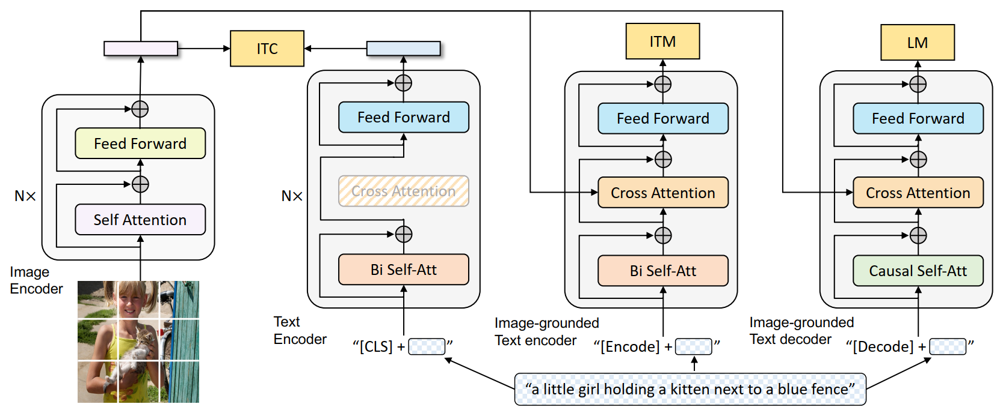

# BLIP: Bootstrapping Language-Image Pre-training for Unified Vision-Language Understanding and Generation



## BLIP_Base

```python
class BLIP_Base(nn.Module):
    def __init__(self,                 
                 med_config = 'configs/med_config.json',  
                 image_size = 224,
                 vit = 'base',
                 vit_grad_ckpt = False,
                 vit_ckpt_layer = 0,                 
                 ):
        """
        Args:
            med_config (str): path for the mixture of encoder-decoder model's configuration file
            image_size (int): input image size
            vit (str): model size of vision transformer
        """               
        super().__init__()
        
        self.visual_encoder, vision_width = create_vit(vit,image_size, vit_grad_ckpt, vit_ckpt_layer)
        self.tokenizer = init_tokenizer()   
        med_config = BertConfig.from_json_file(med_config)
        med_config.encoder_width = vision_width
        self.text_encoder = BertModel(config=med_config, add_pooling_layer=False)  

        
    def forward(self, image, caption, mode):
        
        assert mode in ['image', 'text', 'multimodal'], "mode parameter must be image, text, or multimodal"
        text = self.tokenizer(caption, return_tensors="pt").to(image.device) 
        
        if mode=='image':    
            # return image features
            image_embeds = self.visual_encoder(image)             
            return image_embeds
        
        elif mode=='text':
            # return text features
            text_output = self.text_encoder(text.input_ids, attention_mask = text.attention_mask,                      
                                            return_dict = True, mode = 'text')  
            return text_output.last_hidden_state
        
        elif mode=='multimodal':
            # return multimodel features
            image_embeds = self.visual_encoder(image)    
            image_atts = torch.ones(image_embeds.size()[:-1],dtype=torch.long).to(image.device)      
            
            text.input_ids[:,0] = self.tokenizer.enc_token_id
            output = self.text_encoder(text.input_ids,
                                       attention_mask = text.attention_mask,
                                       encoder_hidden_states = image_embeds,
                                       encoder_attention_mask = image_atts,      
                                       return_dict = True,
                                      )              
            return output.last_hidden_state
```

# BLIP_ITM&ITC

```python
class BLIP_ITM(nn.Module):
    def __init__(self,                 
                 med_config = 'configs/med_config.json',  
                 image_size = 384,
                 vit = 'base',
                 vit_grad_ckpt = False,
                 vit_ckpt_layer = 0,                      
                 embed_dim = 256,     
                 ):
        """
        Args:
            med_config (str): path for the mixture of encoder-decoder model's configuration file
            image_size (int): input image size
            vit (str): model size of vision transformer
        """               
        super().__init__()
        
        self.visual_encoder, vision_width = create_vit(vit,image_size, vit_grad_ckpt, vit_ckpt_layer)
        self.tokenizer = init_tokenizer()   
        med_config = BertConfig.from_json_file(med_config)
        med_config.encoder_width = vision_width
        self.text_encoder = BertModel(config=med_config, add_pooling_layer=False)          

        text_width = self.text_encoder.config.hidden_size
        
        self.vision_proj = nn.Linear(vision_width, embed_dim)
        self.text_proj = nn.Linear(text_width, embed_dim)

        self.itm_head = nn.Linear(text_width, 2) 
        
        
    def forward(self, image, caption, match_head='itm'):

        image_embeds = self.visual_encoder(image) 
        image_atts = torch.ones(image_embeds.size()[:-1],dtype=torch.long).to(image.device)        
      
        text = self.tokenizer(caption, padding='max_length', truncation=True, max_length=35, 
                              return_tensors="pt").to(image.device) 

                 
        if match_head=='itm':
            output = self.text_encoder(text.input_ids,
                                       attention_mask = text.attention_mask,
                                       encoder_hidden_states = image_embeds,
                                       encoder_attention_mask = image_atts,      
                                       return_dict = True,
                                      )
            itm_output = self.itm_head(output.last_hidden_state[:,0,:])     
            return itm_output
            
        elif match_head=='itc':
            text_output = self.text_encoder(text.input_ids, attention_mask = text.attention_mask,                      
                                            return_dict = True, mode = 'text')                     
            image_feat = F.normalize(self.vision_proj(image_embeds[:,0,:]),dim=-1)   
            text_feat = F.normalize(self.text_proj(text_output.last_hidden_state[:,0,:]),dim=-1)    
            
            sim = image_feat @ text_feat.t()
            return sim
```

# BLIP_Decoder (LM)

```python
class BLIP_Decoder(nn.Module):
    def __init__(self,                 
                 med_config = 'configs/med_config.json',  
                 image_size = 384,
                 vit = 'base',
                 vit_grad_ckpt = False,
                 vit_ckpt_layer = 0,
                 prompt = 'a picture of ',
                 ):
        """
        Args:
            med_config (str): path for the mixture of encoder-decoder model's configuration file
            image_size (int): input image size
            vit (str): model size of vision transformer
        """            
        super().__init__()
        
        self.visual_encoder, vision_width = create_vit(vit,image_size, vit_grad_ckpt, vit_ckpt_layer)
        self.tokenizer = init_tokenizer()   
        med_config = BertConfig.from_json_file(med_config)
        med_config.encoder_width = vision_width
        self.text_decoder = BertLMHeadModel(config=med_config)    
        
        self.prompt = prompt
        self.prompt_length = len(self.tokenizer(self.prompt).input_ids)-1

        
    def forward(self, image, caption):
        
        image_embeds = self.visual_encoder(image) 
        image_atts = torch.ones(image_embeds.size()[:-1],dtype=torch.long).to(image.device)
        
        text = self.tokenizer(caption, padding='longest', truncation=True, max_length=40, return_tensors="pt").to(image.device) 
        
        text.input_ids[:,0] = self.tokenizer.bos_token_id
        
        decoder_targets = text.input_ids.masked_fill(text.input_ids == self.tokenizer.pad_token_id, -100)         
        decoder_targets[:,:self.prompt_length] = -100
     
        decoder_output = self.text_decoder(text.input_ids, 
                                           attention_mask = text.attention_mask, 
                                           encoder_hidden_states = image_embeds,
                                           encoder_attention_mask = image_atts,                  
                                           labels = decoder_targets,
                                           return_dict = True,   
                                          )   
        loss_lm = decoder_output.loss
        
        return loss_lm
        
    def generate(self, image, sample=False, num_beams=3, max_length=30, min_length=10, top_p=0.9, repetition_penalty=1.0):
        image_embeds = self.visual_encoder(image)

        if not sample:
            image_embeds = image_embeds.repeat_interleave(num_beams,dim=0)
            
        image_atts = torch.ones(image_embeds.size()[:-1],dtype=torch.long).to(image.device)
        model_kwargs = {"encoder_hidden_states": image_embeds, "encoder_attention_mask":image_atts}
        
        prompt = [self.prompt] * image.size(0)
        input_ids = self.tokenizer(prompt, return_tensors="pt").input_ids.to(image.device) 
        input_ids[:,0] = self.tokenizer.bos_token_id
        input_ids = input_ids[:, :-1] 

        if sample:
            #nucleus sampling
            outputs = self.text_decoder.generate(input_ids=input_ids,
                                                  max_length=max_length,
                                                  min_length=min_length,
                                                  do_sample=True,
                                                  top_p=top_p,
                                                  num_return_sequences=1,
                                                  eos_token_id=self.tokenizer.sep_token_id,
                                                  pad_token_id=self.tokenizer.pad_token_id, 
                                                  repetition_penalty=1.1,                                            
                                                  **model_kwargs)
        else:
            #beam search
            outputs = self.text_decoder.generate(input_ids=input_ids,
                                                  max_length=max_length,
                                                  min_length=min_length,
                                                  num_beams=num_beams,
                                                  eos_token_id=self.tokenizer.sep_token_id,
                                                  pad_token_id=self.tokenizer.pad_token_id,     
                                                  repetition_penalty=repetition_penalty,
                                                  **model_kwargs)            
            
        captions = []    
        for output in outputs:
            caption = self.tokenizer.decode(output, skip_special_tokens=True)    
            captions.append(caption[len(self.prompt):])
        return captions
```

forward方法和generate方法区别如下：

* forward用于训练，接收batch输入，并且使用caption的前N个单词预测第N+1个单词

* generate方法用于推理，是用自回归的方法生成一段caption
