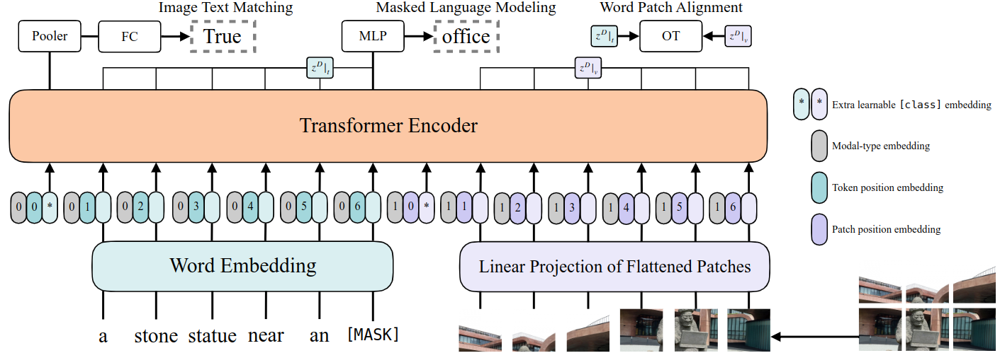

# ViLT: Vision-and-Language Transformer Without Convolution or Region Supervision

视觉-语言模型的四种范式：每个矩形的高度表示它的相对计算大小。VE、TE 和 MI 分别代表视觉编码器、文本编码器和模态交互器


ViLT 模型的总体架构



# Visual Embedding

```python
# 位置编码
class PositionalEncoding(nn.Module):
    def __init__(self, d_model, max_len=512):
        super(PositionalEncoding, self).__init__()
        pe = torch.zeros(max_len, d_model)
        position = torch.arange(0, max_len, dtype=torch.float).unsqueeze(1)
        div_term = torch.exp(torch.arange(0, d_model, 2).float() * (-torch.log(torch.tensor(10000.0)) / d_model))
        pe[:, 0::2] = torch.sin(position * div_term)
        pe[:, 1::2] = torch.cos(position * div_term)
        self.register_buffer('pe', pe.unsqueeze(0))

    def forward(self, x):
        x = x + self.pe[:, :x.size(1)]
        return x


# 图像块嵌入
class PatchEmbedding(nn.Module):
    def __init__(self, image_size, patch_size, in_channels, embed_dim):
        super(PatchEmbedding, self).__init__()
        self.image_size = image_size
        self.patch_size = patch_size
        self.num_patches = (image_size // patch_size) * (image_size // patch_size)

        self.proj = nn.Conv2d(in_channels, embed_dim, kernel_size=patch_size, stride=patch_size)

    def forward(self, x):
        x = self.proj(x)
        x = x.flatten(2)
        x = x.transpose(1, 2)
        return x
```

# Test Embedding

```python
# 文本嵌入
class TextEmbedding(nn.Module):
    def __init__(self, vocab_size, embed_dim):
        super(TextEmbedding, self).__init__()
        self.embedding = nn.Embedding(vocab_size, embed_dim)

    def forward(self, x):
        return self.embedding(x)
```

# Transformer Encoder

```python
# 多头注意力机制
class MultiHeadAttention(nn.Module):
    def __init__(self, d_model, num_heads):
        super(MultiHeadAttention, self).__init__()
        assert d_model % num_heads == 0, "d_model must be divisible by num_heads"

        self.d_model = d_model
        self.num_heads = num_heads
        self.d_k = d_model // num_heads

        self.W_q = nn.Linear(d_model, d_model)
        self.W_k = nn.Linear(d_model, d_model)
        self.W_v = nn.Linear(d_model, d_model)
        self.W_o = nn.Linear(d_model, d_model)

    def scaled_dot_product_attention(self, Q, K, V, mask=None):
        attn_scores = torch.matmul(Q, K.transpose(-2, -1)) / torch.sqrt(torch.tensor(self.d_k, dtype=torch.float32))
        if mask is not None:
            attn_scores = attn_scores.masked_fill(mask == 0, -1e9)
        attn_probs = F.softmax(attn_scores, dim=-1)
        output = torch.matmul(attn_probs, V)
        return output

    def split_heads(self, x):
        batch_size, seq_length, d_model = x.size()
        return x.view(batch_size, seq_length, self.num_heads, self.d_k).transpose(1, 2)

    def combine_heads(self, x):
        batch_size, num_heads, seq_length, d_k = x.size()
        return x.transpose(1, 2).contiguous().view(batch_size, seq_length, self.d_model)

    def forward(self, Q, K, V, mask=None):
        Q = self.split_heads(self.W_q(Q))
        K = self.split_heads(self.W_k(K))
        V = self.split_heads(self.W_v(V))

        attn_output = self.scaled_dot_product_attention(Q, K, V, mask)
        output = self.W_o(self.combine_heads(attn_output))
        return output


# 前馈神经网络
class PositionwiseFeedForward(nn.Module):
    def __init__(self, d_model, d_ff):
        super(PositionwiseFeedForward, self).__init__()
        self.fc1 = nn.Linear(d_model, d_ff)
        self.fc2 = nn.Linear(d_ff, d_model)
        self.relu = nn.ReLU()

    def forward(self, x):
        return self.fc2(self.relu(self.fc1(x)))


# 编码器层
class EncoderLayer(nn.Module):
    def __init__(self, d_model, num_heads, d_ff, dropout):
        super(EncoderLayer, self).__init__()
        self.self_attn = MultiHeadAttention(d_model, num_heads)
        self.feed_forward = PositionwiseFeedForward(d_model, d_ff)
        self.norm1 = nn.LayerNorm(d_model)
        self.norm2 = nn.LayerNorm(d_model)
        self.dropout = nn.Dropout(dropout)

    def forward(self, x, mask):
        attn_output = self.self_attn(x, x, x, mask)
        x = self.norm1(x + self.dropout(attn_output))
        ff_output = self.feed_forward(x)
        x = self.norm2(x + self.dropout(ff_output))
        return x
```

# ViLT

```python
# ViLT 模型
class ViLT(nn.Module):
    def __init__(self, image_size=224, patch_size=16, in_channels=3, vocab_size=30522,
                 embed_dim=768, num_heads=12, num_layers=12, d_ff=3072, dropout=0.1):
        super(ViLT, self).__init__()
        self.image_embed = PatchEmbedding(image_size, patch_size, in_channels, embed_dim)
        self.text_embed = TextEmbedding(vocab_size, embed_dim)
        self.positional_encoding = PositionalEncoding(embed_dim)
        self.image_cls_token = nn.Parameter(torch.zeros(1, 1, embed_dim))
        self.text_cls_token = nn.Parameter(torch.zeros(1, 1, embed_dim))
        self.modal_type_embedding = ModalTypeEmbedding(embed_dim)
        self.encoder_layers = nn.ModuleList([
            EncoderLayer(embed_dim, num_heads, d_ff, dropout) for _ in range(num_layers)
        ])
        self.norm = nn.LayerNorm(embed_dim)
        # 添加 pooler
        self.pooler = nn.Linear(embed_dim, embed_dim)
        self.tanh = nn.Tanh()

    def forward(self, images, texts):
        batch_size = images.size(0)

        # 图像嵌入
        image_embeddings = self.image_embed(images)
        # 为图像嵌入添加 cls token
        image_cls_tokens = self.image_cls_token.expand(batch_size, -1, -1)
        image_embeddings = torch.cat([image_cls_tokens, image_embeddings], dim=1)

        # 文本嵌入
        text_embeddings = self.text_embed(texts)
        # 为文本嵌入添加 cls token
        text_cls_tokens = self.text_cls_token.expand(batch_size, -1, -1)
        text_embeddings = torch.cat([text_cls_tokens, text_embeddings], dim=1)

        # 添加模态类型嵌入
        image_embeddings, text_embeddings = self.modal_type_embedding(image_embeddings, text_embeddings)

        # 为文本嵌入添加位置编码
        text_embeddings = self.positional_encoding(text_embeddings)
        # 为图像嵌入添加位置编码
        image_embeddings = self.positional_encoding(image_embeddings)

        # 合并图像和文本嵌入
        embeddings = torch.cat([image_embeddings, text_embeddings], dim=1)

        # 掩码（简单示例，实际应用中可能更复杂）
        mask = torch.ones(embeddings.size(0), embeddings.size(1), dtype=torch.bool)

        # 编码器层
        for layer in self.encoder_layers:
            embeddings = layer(embeddings, mask)

        # 归一化
        embeddings = self.norm(embeddings)

        # 获取图像和文本的特征
        image_feats = embeddings[:, :image_embeddings.size(1)]
        text_feats = embeddings[:, image_embeddings.size(1):]

        # 获取 CLS 标记的输出
        cls_output = embeddings[:, 0]
        # 通过 pooler 获取全局的 cls_feats
        cls_feats = self.tanh(self.pooler(cls_output))

        return image_feats, text_feats, cls_feat
```

# Pre-Train Objective

## Image Text Matching

以0.5的概率将对齐后的图像随机替换为不同的图像。单个线性层ITM头将Pooler的输出特征`cls_feat`投影到二分类上，并且计算`negative log-likelihood loss `作为ITM损失

## Masked Language Modeling

目标是从其上下文向量`text_feats`中预测masked文本的真实标签
