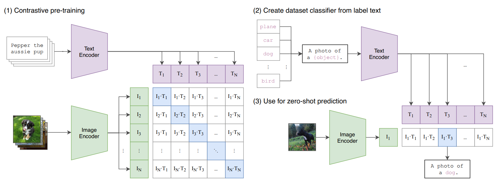

# Learning Transferable Visual Models From Natural Language Supervision (CLIP)



# Image Encoder

## Patch Embedding

```python
# 之前实现的 ViT 模型部分代码
class PatchEmbedding(nn.Module):
    def __init__(self, image_size, patch_size, in_channels, embed_dim):
        super(PatchEmbedding, self).__init__()
        self.image_size = image_size
        self.patch_size = patch_size
        self.num_patches = (image_size // patch_size) * (image_size // patch_size)

        self.proj = nn.Conv2d(in_channels, embed_dim, kernel_size=patch_size, stride=patch_size)

    def forward(self, x):
        x = self.proj(x)
        x = x.flatten(2)
        x = x.transpose(1, 2)
        return x
```

## Multi-head Attention

```python
class MultiHeadAttention(nn.Module):
    def __init__(self, embed_dim, num_heads):
        super(MultiHeadAttention, self).__init__()
        assert embed_dim % num_heads == 0, "embed_dim must be divisible by num_heads"
        self.embed_dim = embed_dim
        self.num_heads = num_heads
        self.head_dim = embed_dim // num_heads

        self.qkv_proj = nn.Linear(embed_dim, 3 * embed_dim)
        self.out_proj = nn.Linear(embed_dim, embed_dim)

    def forward(self, x):
        B, N, _ = x.shape
        qkv = self.qkv_proj(x).reshape(B, N, 3, self.num_heads, self.head_dim).permute(2, 0, 3, 1, 4)
        q, k, v = qkv[0], qkv[1], qkv[2]

        attn_scores = torch.matmul(q, k.transpose(-2, -1)) / (self.head_dim ** 0.5)
        attn_probs = torch.softmax(attn_scores, dim=-1)
        attn_output = torch.matmul(attn_probs, v)
        attn_output = attn_output.transpose(1, 2).reshape(B, N, self.embed_dim)
        output = self.out_proj(attn_output)
        return output
```

## MLP

```python
class MLP(nn.Module):
    def __init__(self, in_features, hidden_features):
        super(MLP, self).__init__()
        self.fc1 = nn.Linear(in_features, hidden_features)
        self.act = nn.GELU()
        self.fc2 = nn.Linear(hidden_features, in_features)

    def forward(self, x):
        x = self.fc1(x)
        x = self.act(x)
        x = self.fc2(x)
        return x
```

## Transformer Block

```python
class TransformerBlock(nn.Module):
    def __init__(self, embed_dim, num_heads, mlp_hidden_dim, dropout=0.):
        super(TransformerBlock, self).__init__()
        self.norm1 = nn.LayerNorm(embed_dim)
        self.attn = MultiHeadAttention(embed_dim, num_heads)
        self.dropout = nn.Dropout(dropout)
        self.norm2 = nn.LayerNorm(embed_dim)
        self.mlp = MLP(embed_dim, mlp_hidden_dim)

    def forward(self, x):
        identity = x
        x = self.norm1(x)
        x = self.attn(x)
        x = self.dropout(x)
        x = x + identity

        identity = x
        x = self.norm2(x)
        x = self.mlp(x)
        x = self.dropout(x)
        x = x + identity
        return x
```

## ViT

```python
class ViT(nn.Module):
    def __init__(self, image_size=224, patch_size=16, in_channels=3, num_classes=1000,
                 embed_dim=768, num_heads=12, num_layers=12, mlp_hidden_dim=3072, dropout=0.):
        super(ViT, self).__init__()
        self.patch_embed = PatchEmbedding(image_size, patch_size, in_channels, embed_dim)
        self.cls_token = nn.Parameter(torch.zeros(1, 1, embed_dim))
        self.pos_embed = nn.Parameter(torch.zeros(1, 1 + self.patch_embed.num_patches, embed_dim))
        self.dropout = nn.Dropout(dropout)
        self.blocks = nn.ModuleList([
            TransformerBlock(embed_dim, num_heads, mlp_hidden_dim, dropout)
            for _ in range(num_layers)
        ])
        self.norm = nn.LayerNorm(embed_dim)

    def forward(self, x):
        x = self.patch_embed(x)
        cls_tokens = self.cls_token.expand(x.shape[0], -1, -1)
        x = torch.cat((cls_tokens, x), dim=1)
        x = x + self.pos_embed
        x = self.dropout(x)

        for block in self.blocks:
            x = block(x)

        x = self.norm(x)
        cls_token_output = x[:, 0]
        return cls_token_output
```

# Text Encoder

## Positional Embedding

```python
class PositionalEncoding(nn.Module):
    def __init__(self, d_model, max_len=512):
        super(PositionalEncoding, self).__init__()
        pe = torch.zeros(max_len, d_model)
        position = torch.arange(0, max_len, dtype=torch.float).unsqueeze(1)
        div_term = torch.exp(torch.arange(0, d_model, 2).float() * (-torch.log(torch.tensor(10000.0)) / d_model))
        pe[:, 0::2] = torch.sin(position * div_term)
        pe[:, 1::2] = torch.cos(position * div_term)
        self.register_buffer('pe', pe.unsqueeze(0))

    def forward(self, x):
        x = x + self.pe[:, :x.size(1)]
        return x
```

## Encoder

```python
# 文本编码器（简单示例，实际中可使用更复杂的模型）
class TextEncoder(nn.Module):
    def __init__(self, vocab_size, d_model=768, num_layers=6, num_heads=12, d_ff=3072, max_len=512, dropout=0.1):
        super(TextEncoder, self).__init__()
        self.embeddings = nn.Embedding(vocab_size, d_model)
        self.positional_encoding = PositionalEncoding(d_model, max_len)
        self.transformer_encoder = nn.TransformerEncoder(
            nn.TransformerEncoderLayer(d_model, num_heads, d_ff, dropout),
            num_layers
        )

    def forward(self, text):
        embedded = self.embeddings(text)
        embedded = self.positional_encoding(embedded)
        output = self.transformer_encoder(embedded)
        pooled_output = output.mean(dim=1)
        return pooled_output
```

# CLIP

```python
# CLIP 模型
class CLIP(nn.Module):
    def __init__(self, image_size=224, patch_size=16, in_channels=3, vocab_size=30522,
                 embed_dim=768, num_heads=12, num_layers=12, mlp_hidden_dim=3072, dropout=0.,
                 d_model=768, text_num_layers=6, text_num_heads=12, text_d_ff=3072, max_len=512, text_dropout=0.1):
        super(CLIP, self).__init__()
        self.image_encoder = ViT(image_size, patch_size, in_channels, embed_dim=embed_dim,
                                 num_heads=num_heads, num_layers=num_layers, mlp_hidden_dim=mlp_hidden_dim,
                                 dropout=dropout)
        self.text_encoder = TextEncoder(vocab_size, d_model, text_num_layers, text_num_heads,
                                        text_d_ff, max_len, text_dropout)
        self.logit_scale = nn.Parameter(torch.ones([]) * torch.log(torch.tensor(1 / 0.07)))

    def forward(self, images, texts):
        image_features = self.image_encoder(images)
        text_features = self.text_encoder(texts)

        # 归一化特征
        image_features = F.normalize(image_features, dim=-1)
        text_features = F.normalize(text_features, dim=-1)

        # 计算相似度
        logit_scale = self.logit_scale.exp()
        logits_per_image = logit_scale * image_features @ text_features.t()
        logits_per_text = logit_scale * text_features @ image_features.t()

        return logits_per_image, logits_per_text
```


