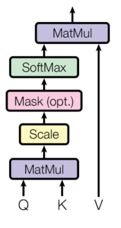
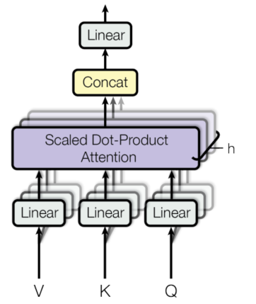
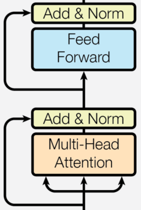
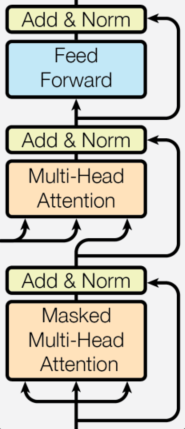

Pytorch代码图解Transformer


# scaled dot-product attention

缩放点积注意力



* Key和Value的序列长度必须相等，最终输出的长度与Query相等

```python
def scaled_dot_product_attention(self, Q, K, V, mask=None):
    # Q,K,V:[batch_size, n_heads, seq_len_{q,k,v}, d_{q,k,v}]
    # K.transpose(-2, -1):[batch_size, n_heads, d_k, seq_len_k]
    # torch.matmul:提取公因数batch_size, n_heads,在d_k维度上做点积
    # d_k是单个head的维度:d_k = d_model // num_heads，缩放因子是sqrt(d_k)
    # attn_scores:[batch_size, n_heads, seq_len_q, seq_len_k]
    attn_scores = torch.matmul(Q, K.transpose(-2, -1)) / torch.sqrt(torch.tensor(self.d_k, dtype=torch.float32))
    if mask is not None:
        # mask:mask等于0的地方attn_scores归零
        attn_scores = attn_scores.masked_fill(mask == 0, -1e9)
    attn_probs = F.softmax(attn_scores, dim=-1)
    # attn_probs:[batch_size, n_heads, seq_len_q, seq_len_k]
    # V:[batch_size, n_heads, seq_len_v, d_v]
    # 由于seq_len_k = seq_len_v, matmul后, 最后输出的长度是Q的长度
    # output:[batch_size, n_heads, seq_len_q, d_v]
    output = torch.matmul(attn_probs, V)
    return output
```

# multi-head attention

多头注意力模块



```python
# 多头注意力机制
class MultiHeadAttention(nn.Module):
    def __init__(self, d_model, num_heads):
        super(MultiHeadAttention, self).__init__()
        assert d_model % num_heads == 0, "d_model must be divisible by num_heads"

        self.d_model = d_model
        self.num_heads = num_heads
        self.d_k = d_model // num_heads

        self.W_q = nn.Linear(d_model, d_model)
        self.W_k = nn.Linear(d_model, d_model)
        self.W_v = nn.Linear(d_model, d_model)
        self.W_o = nn.Linear(d_model, d_model)

    def scaled_dot_product_attention(self, Q, K, V, mask=None):
        attn_scores = torch.matmul(Q, K.transpose(-2, -1)) / torch.sqrt(torch.tensor(self.d_k, dtype=torch.float32))
        if mask is not None:
            attn_scores = attn_scores.masked_fill(mask == 0, -1e9)
        attn_probs = F.softmax(attn_scores, dim=-1)
        output = torch.matmul(attn_probs, V)
        return output

    def split_heads(self, x):
        batch_size, seq_length, d_model = x.size()
        return x.view(batch_size, seq_length, self.num_heads, self.d_k).transpose(1, 2)

    def combine_heads(self, x):
        batch_size, num_heads, seq_length, d_k = x.size()
        return x.transpose(1, 2).contiguous().view(batch_size, seq_length, self.d_model)

    def forward(self, Q, K, V, mask=None):
        # Q,K,V:[batch_size, n_heads, seq_len_{q,k,v}, d_{q,k,v}]
        Q = self.split_heads(self.W_q(Q))
        K = self.split_heads(self.W_k(K))
        V = self.split_heads(self.W_v(V))
        # attn_output:[batch_size, n_heads, seq_len_q, d_v]
        attn_output = self.scaled_dot_product_attention(Q, K, V, mask)
        # combine后:[batch_size, seq_len_q, d_model(n_heads*d_v)]
        # output:[batch_size, seq_len_q, d_model(n_heads*d_v)]
        output = self.W_o(self.combine_heads(attn_output))
        return output


# 前馈神经网络
class PositionwiseFeedForward(nn.Module):
    def __init__(self, d_model, d_ff):
        super(PositionwiseFeedForward, self).__init__()
        self.fc1 = nn.Linear(d_model, d_ff)
        self.fc2 = nn.Linear(d_ff, d_model)
        self.relu = nn.ReLU()

    def forward(self, x):
        return self.fc2(self.relu(self.fc1(x)))
```

# feed forward

```python
# 前馈神经网络
class PositionwiseFeedForward(nn.Module):
    def __init__(self, d_model, d_ff):
        super(PositionwiseFeedForward, self).__init__()
        self.fc1 = nn.Linear(d_model, d_ff)
        self.fc2 = nn.Linear(d_ff, d_model)
        self.relu = nn.ReLU()

    def forward(self, x):
        return self.fc2(self.relu(self.fc1(x)))
```

# encoder layer



```python
# 编码器层
class EncoderLayer(nn.Module):
    def __init__(self, d_model, num_heads, d_ff, dropout):
        super(EncoderLayer, self).__init__()
        self.self_attn = MultiHeadAttention(d_model, num_heads)
        self.feed_forward = PositionwiseFeedForward(d_model, d_ff)
        self.norm1 = nn.LayerNorm(d_model)
        self.norm2 = nn.LayerNorm(d_model)
        self.dropout = nn.Dropout(dropout)

    def forward(self, x, mask):
        # self-attention:Q=K=V=x
        attn_output = self.self_attn(x, x, x, mask)
        x = self.norm1(x + self.dropout(attn_output))
        ff_output = self.feed_forward(x)
        x = self.norm2(x + self.dropout(ff_output))
        return x
```

# encoder

encoder_layer*N

```python
# 编码器
class Encoder(nn.Module):
    def __init__(self, num_layers, d_model, num_heads, d_ff, input_vocab_size, maximum_position_encoding, dropout):
        super(Encoder, self).__init__()
        self.d_model = d_model
        self.embedding = nn.Embedding(input_vocab_size, d_model)
        self.pos_encoding = nn.Parameter(torch.zeros(1, maximum_position_encoding, d_model))
        self.layers = nn.ModuleList([EncoderLayer(d_model, num_heads, d_ff, dropout) for _ in range(num_layers)])
        self.dropout = nn.Dropout(dropout)

    def forward(self, x, mask):
        seq_length = x.size(1)
        x = self.embedding(x) * torch.sqrt(torch.tensor(self.d_model, dtype=torch.float32))
        x += self.pos_encoding[:, :seq_length, :]
        x = self.dropout(x)

        for layer in self.layers:
            x = layer(x, mask)
        return x
```

# decoder layer



```python
# 解码器层
class DecoderLayer(nn.Module):
    def __init__(self, d_model, num_heads, d_ff, dropout):
        super(DecoderLayer, self).__init__()
        self.self_attn = MultiHeadAttention(d_model, num_heads)
        self.cross_attn = MultiHeadAttention(d_model, num_heads)
        self.feed_forward = PositionwiseFeedForward(d_model, d_ff)
        self.norm1 = nn.LayerNorm(d_model)
        self.norm2 = nn.LayerNorm(d_model)
        self.norm3 = nn.LayerNorm(d_model)
        self.dropout = nn.Dropout(dropout)

    def forward(self, x, enc_output, src_mask, tgt_mask):
        # self-attention:Q=K=V=x
        attn_output1 = self.self_attn(x, x, x, tgt_mask)
        x = self.norm1(x + self.dropout(attn_output1))
        # cross-attention:Q=x,K=V=enc_output
        attn_output2 = self.cross_attn(x, enc_output, enc_output, src_mask)
        x = self.norm2(x + self.dropout(attn_output2))
        ff_output = self.feed_forward(x)
        x = self.norm3(x + self.dropout(ff_output))
        return x
```

# decoder

decoder_layer*N

```python
# 解码器
class Decoder(nn.Module):
    def __init__(self, num_layers, d_model, num_heads, d_ff, target_vocab_size, maximum_position_encoding, dropout):
        super(Decoder, self).__init__()
        self.d_model = d_model
        self.embedding = nn.Embedding(target_vocab_size, d_model)
        self.pos_encoding = nn.Parameter(torch.zeros(1, maximum_position_encoding, d_model))
        self.layers = nn.ModuleList([DecoderLayer(d_model, num_heads, d_ff, dropout) for _ in range(num_layers)])
        self.dropout = nn.Dropout(dropout)

    def forward(self, x, enc_output, src_mask, tgt_mask):
        seq_length = x.size(1)
        x = self.embedding(x) * torch.sqrt(torch.tensor(self.d_model, dtype=torch.float32))
        x += self.pos_encoding[:, :seq_length, :]
        x = self.dropout(x)

        for layer in self.layers:
            x = layer(x, enc_output, src_mask, tgt_mask)
        return x 
```

# transformer

```python
# Transformer 模型
class Transformer(nn.Module):
    def __init__(self, num_layers, d_model, num_heads, d_ff, input_vocab_size,
                 target_vocab_size, pe_input, pe_target, dropout):
        super(Transformer, self).__init__()
        self.encoder = Encoder(num_layers, d_model, num_heads, d_ff,
                               input_vocab_size, pe_input, dropout)
        self.decoder = Decoder(num_layers, d_model, num_heads, d_ff,
                               target_vocab_size, pe_target, dropout)
        self.final_layer = nn.Linear(d_model, target_vocab_size)

    def forward(self, src, tgt, src_mask, tgt_mask):
        # src_mask用于编码器
        enc_output = self.encoder(src, src_mask)
        dec_output = self.decoder(tgt, enc_output, src_mask, tgt_mask)
        final_output = self.final_layer(dec_output)
        return final_output
```

# mask

mask一般是对Key进行掩码，防止模型看到不该看到的内容，transformer的输入包含两个mask：

### `src_mask`（源序列掩码）

- **含义**：`src_mask` 是针对输入的源序列（即编码器的输入）生成的掩码矩阵。它的形状通常是 `(batch_size, 1, seq_length)`，其中 `batch_size` 是批次大小，`seq_length` 是源序列的长度。在这个矩阵中，值为 1 的位置表示该位置的元素在注意力计算中会被考虑，而值为 0 的位置表示该位置的元素会被屏蔽。
- **作用**：主要用于处理输入序列中的填充部分。在实际应用中，为了方便批量处理，通常会将不同长度的序列填充到相同的长度，填充的部分在注意力计算中是没有意义的，因此需要通过 `src_mask` 将这些填充位置屏蔽掉，避免模型在这些位置上浪费计算资源，同时防止模型对填充部分产生错误的注意力。
- `src_mask`有两个作用：
  - 对encoder输入做自注意力mask
  - 对decoder的cross-attention的encoder_output做mask

### `tgt_mask`（目标序列掩码）

- **含义**：`tgt_mask` 是针对目标序列（即解码器的输入）生成的掩码矩阵。它的形状通常是 `(batch_size, seq_length, seq_length)`，其中 `batch_size` 是批次大小，`seq_length` 是目标序列的长度。这个矩阵通常包含两种类型的掩码：填充掩码和前瞻掩码。填充掩码用于屏蔽目标序列中的填充部分，前瞻掩码用于防止解码器在预测某个位置时看到未来的信息。
- **作用**：
  - **填充掩码**：和 `src_mask` 类似，用于屏蔽目标序列中的填充部分，避免模型对填充部分产生注意力。
  - **前瞻掩码**：在解码器中，为了保证模型的自回归特性，即模型在预测某个位置的输出时只能依赖于该位置之前的输入，需要使用前瞻掩码。前瞻掩码是一个下三角矩阵，对角线及以下的元素为 1，对角线以上的元素为 0，这样可以确保在计算注意力时，每个位置只能关注到该位置及其之前的元素。
- `tgt_mask`作用是对decoder输入做自注意力mask
