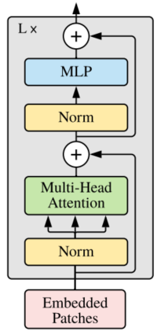
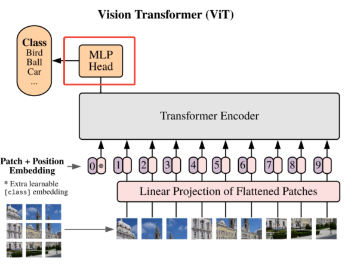
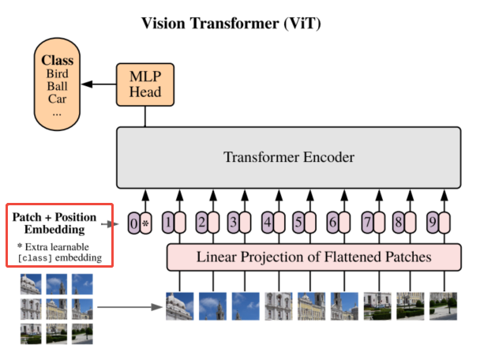

Pytorch代码图解Vision Transformer

# Patch Embedding


```python
class PatchEmbedding(nn.Module):
    def __init__(self, image_size, patch_size, in_channels, embed_dim):
        super(PatchEmbedding, self).__init__()
        self.image_size = image_size
        self.patch_size = patch_size
        self.num_patches = (image_size // patch_size) * (image_size // patch_size)

        self.proj = nn.Conv2d(in_channels, embed_dim, kernel_size=patch_size, stride=patch_size)

    def forward(self, x):
        x = self.proj(x)  # (B, C, H, W) -> (B, embed_dim, num_patches**0.5, num_patches**0.5)
        x = x.flatten(2)  # (B, embed_dim, num_patches**0.5, num_patches**0.5) -> (B, embed_dim, num_patches)
        x = x.transpose(1, 2)  # (B, embed_dim, num_patches) -> (B, num_patches, embed_dim)
        return x
```

# Multi-head Attention



```python
class MultiHeadAttention(nn.Module):
    def __init__(self, embed_dim, num_heads):
        super(MultiHeadAttention, self).__init__()
        assert embed_dim % num_heads == 0, "embed_dim must be divisible by num_heads"
        self.embed_dim = embed_dim
        self.num_heads = num_heads
        self.head_dim = embed_dim // num_heads

        self.qkv_proj = nn.Linear(embed_dim, 3 * embed_dim)
        self.out_proj = nn.Linear(embed_dim, embed_dim)

    def forward(self, x):
        B, N, _ = x.shape
        qkv = self.qkv_proj(x).reshape(B, N, 3, self.num_heads, self.head_dim).permute(2, 0, 3, 1, 4)
        q, k, v = qkv[0], qkv[1], qkv[2]

        attn_scores = torch.matmul(q, k.transpose(-2, -1)) / (self.head_dim ** 0.5)
        attn_probs = torch.softmax(attn_scores, dim=-1)
        attn_output = torch.matmul(attn_probs, v)
        attn_output = attn_output.transpose(1, 2).reshape(B, N, self.embed_dim)
        output = self.out_proj(attn_output)
        return output 
```

# Transformer Encoder


```python
class TransformerBlock(nn.Module):
    def __init__(self, embed_dim, num_heads, mlp_hidden_dim, dropout=0.):
        super(TransformerBlock, self).__init__()
        self.norm1 = nn.LayerNorm(embed_dim)
        self.attn = MultiHeadAttention(embed_dim, num_heads)
        self.dropout = nn.Dropout(dropout)
        self.norm2 = nn.LayerNorm(embed_dim)
        self.mlp = MLP(embed_dim, mlp_hidden_dim)

    def forward(self, x):
        identity = x
        x = self.norm1(x)
        x = self.attn(x)
        x = self.dropout(x)
        x = x + identity

        identity = x
        x = self.norm2(x)
        x = self.mlp(x)
        x = self.dropout(x)
        x = x + identity
        return x
```

# MLP



```python
class MLP(nn.Module):
    def __init__(self, in_features, hidden_features):
        super(MLP, self).__init__()
        self.fc1 = nn.Linear(in_features, hidden_features)
        self.act = nn.GELU()
        self.fc2 = nn.Linear(hidden_features, in_features)

    def forward(self, x):
        x = self.fc1(x)
        x = self.act(x)
        x = self.fc2(x)
        return x
```

# ViT

## Add Class Token and Position Embedding



```python
class ViT(nn.Module):
    def __init__(self, image_size=224, patch_size=16, in_channels=3, num_classes=1000,
                 embed_dim=768, num_heads=12, num_layers=12, mlp_hidden_dim=3072, dropout=0.):
        super(ViT, self).__init__()
        self.patch_embed = PatchEmbedding(image_size, patch_size, in_channels, embed_dim)
        # Add Class Token and Position Embedding
        self.cls_token = nn.Parameter(torch.zeros(1, 1, embed_dim))
        self.pos_embed = nn.Parameter(torch.zeros(1, 1 + self.patch_embed.num_patches, embed_dim))
        self.dropout = nn.Dropout(dropout)
        self.blocks = nn.ModuleList([
            TransformerBlock(embed_dim, num_heads, mlp_hidden_dim, dropout)
            for _ in range(num_layers)
        ])
        self.norm = nn.LayerNorm(embed_dim)
        self.head = nn.Linear(embed_dim, num_classes)

    def forward(self, x):
        x = self.patch_embed(x)
        cls_tokens = self.cls_token.expand(x.shape[0], -1, -1)
        x = torch.cat((cls_tokens, x), dim=1)
        x = x + self.pos_embed
        x = self.dropout(x)

        for block in self.blocks:
            x = block(x)

        x = self.norm(x)
        cls_token_output = x[:, 0]
        output = self.head(cls_token_output)
        return output
```


