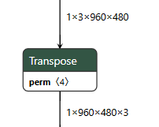
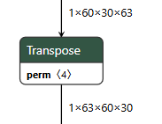
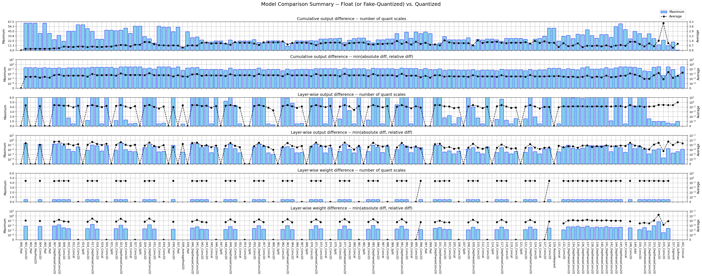

# NeuroPilot模型转化与量化(Pytorch)

## 1 配置环境

官网地址：

https://neuropilot.mediatek.com/sphinx/neuropilot-5-basic-customer/html/

neuropilot-sdk-basic-5.0.6-build20230426支持python3.5、python3.6

neuropilot-sdk-basic-7.0.5-build20240205支持python3.5-3.9

Required:

- argparse >= 1.2

- flatbuffers >= 1.12

- matplotlib >= 3.0

- numpy >= 1.13.3

- packaging

- protobuf >= 3.5.1

- pybind11 >= 2.2

- tqdm >= 4.0

Optional:

- tensorflow version: >= 1.13 and < 2.5 (required by TensorFlow V1 Converter)

- tensorflow version: >= 2.0 and < 2.5 (required by TensorFlow Converter)

- torch version: >= 1.3 and < 1.9 (required by PyTorch Converter)

```bash
# For Python 3.9
$ pip3 install mtk_converter-<version>-cp39-cp39m-manylinux1_x86_64.whl
```

然后

```python
import mtk_converter
print(mtk_converter.__version__)
```

输出

```
7.14.1+release
```

## 2 模型导出

### 2.1 Pytorch环境

```python
import torch
input_shape = [1, cfg.input_channels, cfg.input_height, cfg.input_width]
input_data = torch.randn(input_shape)
script_model = torch.jit.trace(model, input_data)
script_model.save("./exported_model/torchscript.pt")
```

## 2.2 NeuroPilot环境

```python
import mtk_converter
converter = mtk_converter.PyTorchConverter.from_script_module_file(
    script_module_file=torch_pt_model_path,
    input_shapes=[[1, cfg.input_channels, cfg.input_width, cfg.input_height]], 
)
_ = converter.convert_to_tflite(
    output_file=tflite_model_path, 
    tflite_op_export_spec='npsdk_v5', 
    )
```

要注意的是：

* NeuroPilot的宽高顺序和Pytorch的不一样

* 由于NeuroPilot内部张量形状为NHWC，因此在模型转换的时候，会在前后自动插入一个Transpose算子



## 2.3 ModelWrapper

对pytorch模型进行Wrap，将模型输入改为NHWC

```python
class ModelWrapper(torch.nn.Module):
    def __init__(self, model):
        super(ModelWrapper, self).__init__()
        self.model = model

    def forward(self, x):
        x = x.permute(0, 3, 1, 2)  # NHWC to NCHW
        x = self.model(x)
        x = x.permute(0, 2, 3, 1)  # NHWC to NCHW
        return x

model = torch.jit.load(MODEL_IN_PATH)
model_wrapped = ModelWrapper(model) 
```

然后再导出

```python
import mtk_converter
converter = mtk_converter.PyTorchConverter.from_script_module_file(
    script_module_file=torch_pt_model_path,
    input_shapes=[[1, cfg.input_height, cfg.input_width, cfg.input_channels]], 
)
_ = converter.convert_to_tflite(
    output_file=tflite_model_path, 
    tflite_op_export_spec='npsdk_v5', 
    )
```

这样导出的TFLite模型，前后就没有Transpose算子了

## 3 模型量化

量化的开关是

```python
converter.quantize = True
```

可以通过

```python
converter.get_available_options()
```

查看量化的所有参数：

```python
adaround_batch_size
adaround_data_count
adaround_optim_lr
adaround_optim_steps
adaround_preserve_sparsity
allow_4w16a_affine_operators
allow_4w8a_affine_operators
allow_8w16a_affine_operators
allow_asym16_quantization
allow_different_affine_output_quantization_type
allow_incompatible_paddings_for_tflite_pooling
allow_missing_quantization_ranges
allow_softmax_calibration
append_output_dequantize_ops
append_output_dequantize_ops_indices
bias_correction_data_count
calibration_data_count
calibration_data_gen
calibration_ema_debias
calibration_ema_decay
calibration_histogram_loss_type
calibration_histogram_num_bins
calibration_histogram_num_total_samples
calibration_histogram_num_zp_samples
calibration_method
calibration_percentile_value
convert_float32_weights_to_float16
convert_unsupported_data_type
custom_op_lib_map
decompose_batched_matmul_ops
decompose_grouped_conv2d_ops
decompose_grouped_conv3d_ops
decompose_instance_normalization_ops
decompose_log_softmax_ops
decompose_lstm_ops
decompose_unidirectional_sequence_lstm_ops
deduplicate_constant_tensors
deduplicate_operators
default_quantization_bitwidth
default_weights_quantization_bitwidth
enable_12bit_data_types
ensure_safe_affine_output_quantization_scale
ensure_same_concat_quantization_params
export_qparams_config_file
extra_quantization_bypass_ops
hessian_opt_block_size
hessian_opt_data_count
hessian_opt_stability_ratio
hessian_opt_sort_hessian
hessian_opt_use_fast_strategy
import_qparams_config_file
input_quantization_bitwidths
input_value_ranges
precision_config_file
precision_proportion
precision_proportion_bypass_dwconv_ops
precision_proportion_policy
prepend_input_quantize_ops
prepend_input_quantize_ops_indices
quantization_debug_dir
quantize
reroute_trivial_consumer_ops
rewrite_batchnorm_to_dwconv_ops
rewrite_conv_to_dwconv_ops
use_64bit_bias_tensors
use_adaround
use_bias_correction
use_dynamic_quantization
use_hessian_opt
use_per_output_channel_quantization
use_symmetric_quantization
use_unsigned_quantization_type
use_weights_symmetric_quantization
weights_quantization_clipping_ratio
```

### 3.1 量化参数

以下介绍一些重要的量化参数：

```
calibration_data_gen:量化数据的迭代器
allow_dynamic_quantization:开启动态量化
default_weights_quantization_bitwidth:权重量化的bit数
use_per_output_channel_quantization:开启per-channel量化
use_symmetric_quantization:对称量化
use_weights_symmetric_quantization:权重对称量化
```

量化参数设置的例子：

```python
converter.quantize = True
converter.use_per_output_channel_quantization = True
converter.use_unsigned_quantization_type = True
converter.use_weights_symmetric_quantization = False
converter.prepend_input_quantize_ops = False
converter.append_output_dequantize_ops = True
converter.default_weights_quantization_bitwidth = 8
converter.use_bias_correction = True
converter.allow_incompatible_paddings_for_tflite_pooling = True
converter.calibration_method = 'Histogram'
converter.calibration_histogram_loss_type = 'l2_loss'
converter.calibration_data_gen = data_generator
```

### 3.2 量化数据

量化数据的生成器:

```python
def data_generator():
    batch_size = 1

    img_list = os.listdir(QUANT_IMAGES_DIR)[:1]
    steps = len(img_list)
    for i in range(steps):
        batch = []
        for idx in range(batch_size):
            img = cv2.imread(os.path.join(QUANT_IMAGES_DIR, img_list[i % len(img_list)]))
            image_tensor = preprocess_img(img)
            batch.append(image_tensor)
        # Yield a list of numpy arrays with the correct shape [1, h, w, 3]
        yield [np.concatenate(batch, axis=0)]
```

### 3.3 量化误差分析

然后可以进行量化误差的分析：

```python
out_put_analysis = "quant_error_analysis"
input_data = next(data_generator())
mtk_converter.plot_model_quant_error(converter, input_data, out_put_analysis)
```

NeuroPilot会生成这样一张图片：



### 3.4 高级量化功能

使用

```python
converter.export_qparams_config_file  = "q_config.json"
```

将量化的参数保存，文件内容如下：

```python
"version": "v1",
    "quantization_params": [
        {
            "activations": {
                "11": {
                    "dtype": "UINT8",
                    "is_symmetric": false,
                    "min_vals": -6.001996040344238,
                    "max_vals": 6.5431599617004395
                },
                "362_ndsc": {
                    "dtype": "UINT8",
                    "is_symmetric": false,
                    "min_vals": 0.0,
                    "max_vals": 5.554076194763184
                },
                "652_ndsc": {
                    "dtype": "UINT8",
                    "is_symmetric": false,
                    "min_vals": 0.0,
                    "max_vals": 0.99609375
                }
            }
        }
    ]
} 
```

然后可以手动修改这个```q_config.json``` 文件，例如关闭一些层的量化，例如要关闭激活11的量化，将dtype改为FP即可

```python
"version": "v1",
    "quantization_params": [
        {
            "activations": {
                "11": {
                    "dtype": "FP",
                },
                "362_ndsc": {
                    "dtype": "UINT8",
                    "is_symmetric": false,
                    "min_vals": 0.0,
                    "max_vals": 5.554076194763184
                },
                "652_ndsc": {
                    "dtype": "UINT8",
                    "is_symmetric": false,
                    "min_vals": 0.0,
                    "max_vals": 0.99609375
                }
            }
        }
    ]
} 
```
