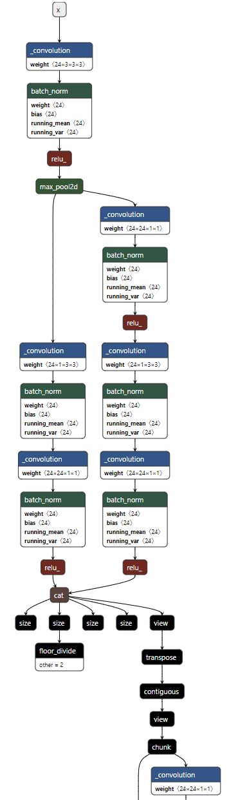
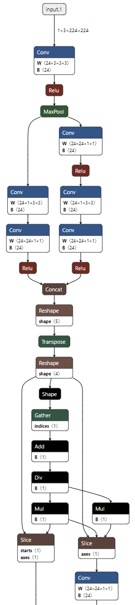
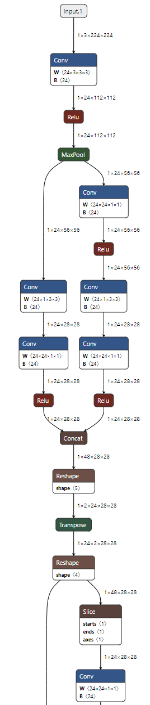
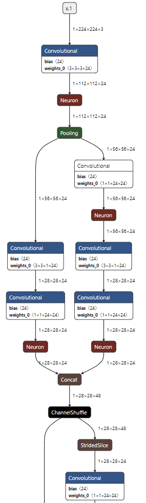
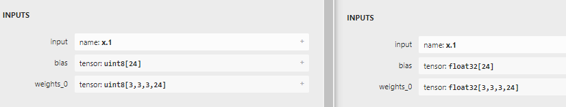

# 1 准备工作

- snpe-1.68.0.3932
- python 3.6
- Ubuntu 服务器
- Android设备（如有）

首先在Ubuntu服务器上配置SNPE SDK

```
export SNPE_ROOT=/root/gh/snpe-1.68.0.3932
```

然后进入SNPE SDK根目录

```
cd $SNPE_ROOT
```

 运行初始化代码

```
source $SNPE_ROOT/bin/envsetup.sh -t .
```

如果看到以下输出，就代表设置成功了，这个warning如果用不到Android NDK的话可以无视。如果提示缺python包，可以用pip或者conda安装

```
[INFO] Setting TENSORFLOW_HOME=.                                                                                  
[WARNING] Can't find ANDROID_NDK_ROOT or ndk-build. SNPE needs android ndk to build the NativeCppExample
```

其实上面的代码是设置python环境tensorflow包的位置，但如果用不到，可以随便给一个参数，如果需要用到的话，可以进入python，然后

```python
>>> import tensorflow as tf
>>> print(tf.__path__)
```

然后将上面的路径改为tensorflow包的路径就可以了。

# 2 模型转换

在SNPE里面，模型都是以dlc格式存储的，因此我们需要将pytorch的pt文件，或者tensorflow、tflite、onnx这些文件格式，统一转换成dlc文件，这一块有许多坑，因为涉及到不同工具包的算子映射，也经常会有奇奇怪怪的错。具体调用方法可以参照 [Snapdragon Neural Processing Engine SDK: Tools](https://developer.qualcomm.com/sites/default/files/docs/snpe/tools.html "Snapdragon Neural Processing Engine SDK: Tools")

我们以shufflenet为例，首先在pytorch环境里实例化模型

```python
import torchvision

model = torchvision.models.shufflenet_v2_x0_5(weights='DEFAULT').eval()
```

可以先存一个pytorch模型看看结构。为了导出pytorch模型，要把普通 PyTorch 模型转一个计算图，有跟踪（trace）和记录（script）两种导出计算图的方法，我们使用第一种

```python
import torch

script_model = torch.jit.trace(model, input_data)
script_model.save("shufflenetv2.pt")
```

使用[netron](https://netron.app/ "netron")可视化模型（只是前面几层）：

​

首先尝试了直接转dlc

```
snpe-pytorch-to-dlc -d ‘1’ 1,3,224,224 -i model/shufflenetv2.pt
```

报了一个很奇怪的错

```
TVMError:                                                                                                         
---------------------------------------------------------------                                                   
An error occurred during the execution of TVM.                                                                    
For more information, please see: https://tvm.apache.org/docs/errors.html                                         
---------------------------------------------------------------                                                   
  Check failed: (false) is false: [17:55:12] /prj/qct/webtech_hyd/pcgbait/projects/zsnpe_waipio/SNPE/ThirdParty/tv
m/src/tvm_fork/src/relay/op/nn/nn.h:86:                                                                           
---------------------------------------------------------------                                                   
An error occurred during the execution of TVM.                                                                    
For more information, please see: https://tvm.apache.org/docs/errors.html                                         
---------------------------------------------------------------                                                   
  Check failed: (reporter->AssertEQ(data->shape[data->shape.size() - 1], weight->shape[1])) is false: DenseRel: in
put dimension doesn't match, data shape=[1, 1024], weight shape=[1024, 1000]
```

全网都没说清楚是什么问题，有的人换了个版本就解决了，但我换了之后还是存在这个问题。

所以我们先导出onnx模型，再用SNPE转换这个onnx模型。

如果使用torch.onnx.export，会自动调用trace方法：

```python
input_shape = [1, 3, 224, 224]
input_data = torch.randn(input_shape)
torch.onnx.export(model,input_data,'shufflenetv2.onnx')
```

相当于省略了

```python
script_model = torch.jit.trace(model, input_data)
```

使用[netron](https://netron.app/ "netron")对onnx模型进行可视化，如图所示

​

我们可以发现不同格式的模型文件，不管是调用的算子还是数据结构还是稍有不同的，但实现的功能是一样的。

我们得到pytorch导出的onnx文件之后，还需要使用onnx模块对他进行修改和简化：

```python
import onnx
from onnxsim import simplify

onnx_model = onnx.load("./shufflenetv2.onnx")
model_simp, check = simplify(onnx_model)
onnx.save(model_simp, "./shufflenetv2_sim.onnx")
```

结构如图所示：

​

我们可以看到结构变得干净了许多，因为onnx对模型进行处理，使用slice这个算子对channel分组的操作进行了整合。

然后我们使用snpe-onnx-to-dlc工具将onnx模型转换成dlc模型，以下代码需要在配置好SNPE SDK的Ubuntu服务器终端下执行

```python
snpe-onnx-to-dlc -i shufflenetv2/shufflenetv2_sim.onnx
```

然后我们会得到一个dlc文件，结构如下：

​

我们可以发现SNPE自动将reshape-transpose-reshape的操作用一个channel shuffle模块代替了，这样模型结构看起来更干净了。

这样我们就得到了一个可以用SNPE运行的dlc文件

# 3 模型分析

在Ubuntu上运行

```python
 snpe-dlc-info -i shufflenetv2_q.dlc -s info_shufflenetv2.csv
```

我们可以得到一个分析文件，他会告诉你每一层的详细信息，以及这个算子可以在哪些设备上运行，还会得到内存使用量，总计算量等理论数据：

| Total parameters: 1362816 (5 MB assuming single precision float)                                                                                                                                                                                                                                                                                                                                                                                                                                                                                                                                                                                                                                                                                                                                                                                                                                                                                                                                                     |
| -------------------------------------------------------------------------------------------------------------------------------------------------------------------------------------------------------------------------------------------------------------------------------------------------------------------------------------------------------------------------------------------------------------------------------------------------------------------------------------------------------------------------------------------------------------------------------------------------------------------------------------------------------------------------------------------------------------------------------------------------------------------------------------------------------------------------------------------------------------------------------------------------------------------------------------------------------------------------------------------------------------------- |
| Total MACs per inference: 40M (100%)                                                                                                                                                                                                                                                                                                                                                                                                                                                                                                                                                                                                                                                                                                                                                                                                                                                                                                                                                                                 |
| Converter command: snpe-onnx-to-dlc adjust_nms_features_dims=False align_matmul_ranks=True batch=None copyright_file=None custom_op_config_paths=None debug=-1 define_symbol=None disable_batchnorm_folding=False dry_run=None dumpIR=False dump_inferred_model=False dump_value_info=False enable_strict_validation=False expand_gru_op_structure=False extract_color_transform=False force_prune_cast_ops=True handle_gather_negative_indices=False inject_cast_for_gather=False input_dim=None input_dtype=[] input_encoding=[] input_layout=[] input_type=[] keep_disconnected_nodes=False keep_quant_nodes=False match_caffe_ssd_to_tf=False model_version=None no_simplification=False out_names=['1066'] perform_axes_to_spatial_first_order=True prepare_inputs_as_params=True preprocess_lstm_ops=False preprocess_roi_pool_inputs=False quantization_overrides= squash_box_decoder=False unroll_gru_time_steps=False unroll_lstm_time_steps=False use_convert_quantization_nodes=True validation_target=[] |
| Quantizer command: N/A                                                                                                                                                                                                                                                                                                                                                                                                                                                                                                                                                                                                                                                                                                                                                                                                                                                                                                                                                                                               |
| DLC created with converter version: 1.68.0.3932                                                                                                                                                                                                                                                                                                                                                                                                                                                                                                                                                                                                                                                                                                                                                                                                                                                                                                                                                                      |
| Layers used by DLC: CHANNEL_SHUFFLE, CONCATENATION, CONVOLUTIONAL, DATA, FULLY_CONNECTED, NEURON_RELU, POOLING, REDUCE_MEAN, STRIDED_SLICE                                                                                                                                                                                                                                                                                                                                                                                                                                                                                                                                                                                                                                                                                                                                                                                                                                                                           |
| Est. Steady-State Memory Needed to Run: 30.6 MiB                                                                                                                                                                                                                                                                                                                                                                                                                                                                                                                                                                                                                                                                                                                                                                                                                                                                                                                                                                     |

# 4 数据准备

使用SNPE调用模型，需要将输入数据保存成二进制文件的格式，我们可以使用如下代码将图片保存成二进制文件

> write_bin.py

```python
# Author: imTurkey 2023/11/14
import os
import sys

import cv2
import numpy as np


def write_folder(dataPath, savePath):

    if not os.path.exists(savePath):
        os.mkdir(savePath)
    savePath_input = os.path.join(savePath, "input.txt")
    savePath_bin = os.path.join(savePath, "img_bin")
    if not os.path.exists(savePath_bin):
        os.mkdir(savePath_bin)
    with open(savePath_input, "w") as f_t:

        new_size = (224, 224)
        filelist = os.listdir(dataPath)
        filelist.sort(key=lambda x: int(x.split('.')[0]))
        for file in filelist:
            filename, ext = os.path.splitext(file)
            img = cv2.imread(os.path.join(dataPath, file))
            img = cv2.resize(img, new_size, interpolation=cv2.INTER_LINEAR)
            img = cv2.cvtColor(img, cv2.COLOR_BGR2RGB)
            img = img / 255.0
            with open(os.path.join(savePath_bin, filename + ".bin"), "wb") as f:
                fortran_data = np.asfortranarray(img, dtype='float32')
                fortran_data.tofile(f)
            f.close()

            f_t.write(os.path.join(savePath_bin, filename + ".bin"))
            f_t.write("\n")

        f_t.close()


if __name__ == "__main__":
    write_folder(sys.argv[1], sys.argv[2])
```


```python
python write_bin.py ./your_data_path ./save_path
```

原始路径中文件如下 

```python
├── 10.jpg                                                                                                        
├── 11.jpg                                                                                                        
├── 1.jpg                                                                                                         
├── 2.jpg                                                                                                         
├── 3.jpg                                                                                                         
├── 4.jpg                                                                                                         
├── 5.jpg                                                                                                         
├── 6.jpg                                                                                                         
├── 7.jpg                                                                                                         
├── 8.jpg                                                                                                         
└── 9.jpg
```

需要安装opencv，生成的文件结构如下

```python
├── img_bin                                                                                                       
│   ├── 10.bin                                                                                                    
│   ├── 11.bin                                                                                                    
│   ├── 1.bin                                                                                                     
│   ├── 2.bin                                                                                                     
│   ├── 3.bin                                                                                                     
│   ├── 4.bin                                                                                                     
│   ├── 5.bin                                                                                                     
│   ├── 6.bin                                                                                                     
│   ├── 7.bin                                                                                                     
│   ├── 8.bin                                                                                                     
│   └── 9.bin                                                                                                     
└── input.txt
```

其中input.txt里面包含了bin文件的绝对路径，有了input.txt文件，我们就可以调用模型了

# 5 模型调用

使用 snpe-net-run 调用我们的模型，首先是在cpu上调用，这一步可以在Ubuntu上执行也可以在Android设备上执行。

```python
snpe-net-run --container shufflenetv2_sim.dlc --input_list ../data224/input.txt --output_dir output_cpu
```

--input_list 参数需要指定上一步生成的input.txt文件位置。注意， input.txt需要是绝对路径，且最好在Linux环境下编写，如果是在windows下，需要切换换行方式CRLF为LF，编码方式为ANSI，否则会报错。

在GPU上运行（注意：这一步应该只能在Android设备上运行）：

```python
snpe-net-run --container model/shufflenetv2_sim.dlc --input_list ../data224/input.txt --output_dir output_gpu --use_gpu
```

 如果我们需要进一步加速，在DSP上运行，我们需要进行模型量化。

# 6 模型量化

如果我们需要在DSP上面运行模型，还需要对模型进行量化，简单理解就是把模型的参数转化为int8，当我们准备好数据后，可以运行以下代码（Ubuntu服务器端）：

```python
snpe-dlc-quantize --input_dlc shufflenetv2_sim.dlc  --input_list ../data224/input.txt --output_dlc shufflenetv2_q.dlc
```

模型量化有很多参数可以调，这也是一门学问，之后有时间再讨论。如果没有报错，我们就得到了量化后的模型，模型结构都没有改变，但我们会发现参数的数据类型已经从float32变成int8

​

# 7 端测推理

## 7.1 环境搭建

准备工作

- snpe-1.68.0.3932
- android设备，开启开发者模式-USB调试功能

推送SNPE到设备上

先连接设备，cmd运行以下代码能看到自己的设备为准

```bash
# 连接设备
adb devices
```

在设备上新建文件夹存储SNPE

```bash
adb shell mkdir -p  /data/local/tmp/snpe1/arm64/lib
adb shell mkdir -p  /data/local/tmp/snpe1/arm64/bin
adb shell mkdir -p  /data/local/tmp/snpe1/dsp/lib
```

推送库文件（.so）

我这里是把SNPE根目录放在了D:\Program下，运行以下代码（要根据处理器的架构选择相应的文件夹，arm架构一般是下面这个）

```bash
# push lib
adb push D:\Program\snpe-1.68.0.3932\lib\aarch64-android-clang8.0\. /data/local/tmp/snpe1/arm64/lib
```

推送和DSP相关的库文件

```bash
# push dsp lib
adb push D:\Program\snpe-1.68.0.3932\lib\dsp\. /data/local/tmp/snpe1/dsp/lib
```

## 推送可执行文件

```bash
# push bin
adb push D:\Program\snpe-1.68.0.3932\bin\aarch64-android-clang8.0\. /data/local/tmp/snpe1/arm64/bin
```

设置环境变量

cmd运行以下命令打开设备终端

```bash
adb shell
```

设置以下环境变量，这些环境变量每次进入终端都需要重新设置，来让系统能找到SNPE的库文件和可执行文件

```bash
# environment varibles
export LD_LIBRARY_PATH=$LD_LIBRARY_PATH:/data/local/tmp/snpe1/arm64/lib
export ADSP_LIBRARY_PATH="/data/local/tmp/snpe1/dsp/lib;/system/vendor/lib/rfsa/adsp"
export PATH=$PATH:/data/local/tmp/snpe1/arm64/bin
```

第一行是SNPE的库文件路径，第二行是DSP相关的库文件，第三行是可执行文件路径

测试是否能运行

```bash
snpe-net-run --version
```

如果提示权限问题，需要授予访问权限

```bash
chmod 777 /data/local/tmp/snpe1/arm64/bin/snpe-net-run
```

看到这样的输出环境就配置完成啦

```bash
SNPE v1.68.0.3932
```

SNPE 1.68在安卓端提供了这几个工具

```bash
snpe-net-run
snpe-parallel-run
snpe-platform-validator
snpe-throughput-net-run
```

## 7.2 运行模型

然后运行代码（Android设备上）

```python
snpe-net-run --container model/shufflenetv2_q.dlc --input_list ../data224/input.txt --output_dir output_dsp --use_dsp
```

如果报错的话可以尝试加上参数 --platform_options unsignedPD:ON

然后我们就得到了模型在DSP上运行的结果

# 8 结果分析

我们可以使用

```python
adb pull /data/local/tmp/shufflenet/ .
```

将结果拉取到本地，然后在Ubuntu上使用

```python
snpe-diagview --input_log output_cpu/SNPEDiag_0.log --output cpu.csv
```

进行结果查看，工具会输出每一层的运行时间和总的运行时间等数据可供分析，在不同设备上的运行时间如下（单位是毫秒）

|     | shufflenet |
| --- | ---------- |
| CPU | 15.080     |
| GPU | 5.101      |
| DSP | 5.720      |

我们可以发现GPU对CPU来说速度提升还是比较显著的，但在DSP上，可能运行速度已经达到瓶颈（毕竟ShuffleNet是特别小的网络，5ms已经特别快了），可能内存访问等时间已经占据了主要的运行时间，提升就不会那么显著，也可能是ShuffleNet的结构在DSP上优化效果不显著？之后再研究。

​
