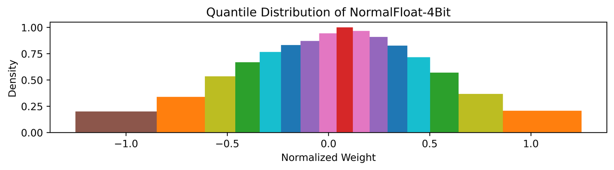
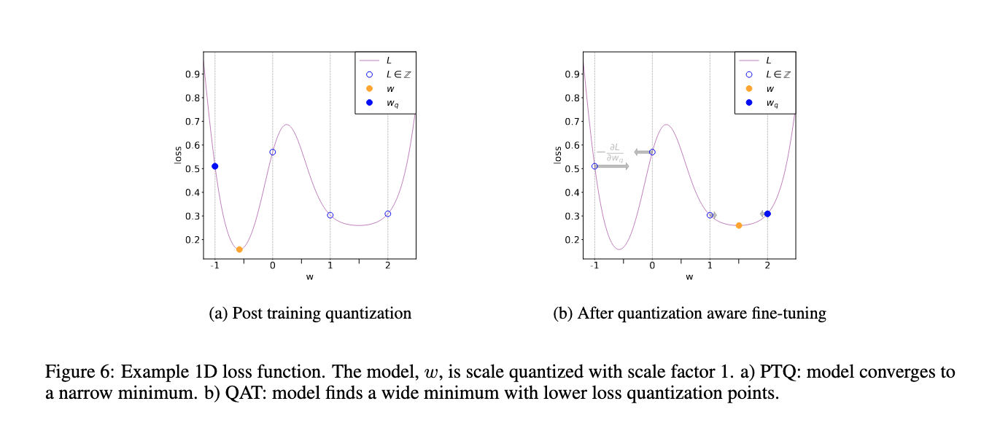

​

# 1. 量化原理

## 1.1 数据格式

### 1.1.1 浮点数

​

对于浮点数来说，指数位（浅绿色部分）表示该精度可达的动态范围，而尾数位（深绿色部分）表示精度。

- FP32 是单精度浮点数，用8bit 表示指数，23bit 表示小数；
- FP16半精度浮点数，用5bit 表示指数，10bit 表示小数；
- BF16和TF32 是一种截短的 Float32 数据格式：
- BF16将FP32 中 23 个尾数位截短为 7 bits，而指数位仍为 8 bits，总长度为 16 (=1 + 8 + 7) bits
- TF32将 FP32 中 23 个尾数位截短为 10 bits，而指数位仍为 8 bits，总长度为 19 (=1 + 8 + 10) bits

此外，FP8是一种8位浮点数据格式，近年来由Nvidia、Arm、Intel等联合推出，用于加速深度学习训练和推理。FP8有两种不同的表示形式：E4M3和E5M2。

- E4M3由1位符号位、4位指数位、3位尾数组成，可以存储高达±448的值以及NaN（非数字）。
- E5M2由1位符号位、5位指数位、2位尾数组成，可以存储最多±57344、±inf（无穷大）和NaN的值。

E4M3能表示的精度更高，而E5M2能表示的动态范围更大。

### 1.1.2 整数

INT8是用 8 bits字节表示的整数（无符号：0~255，有符号：-127~128），此外，还有INT4等更为激进的量化格式

## 1.2 定点量化 Fixed Point Approximation

定点量化的思路其实就是截断，比如我要计算1.234 * 5.678，那么可以只取一位小数，计算1.2 * 5.6来做近似。

> 定点近似主要是缩小浮点表示中的指数和小数部分的位宽，不需要额外的量化参数，也没有反量化过程，实现相对简单，但是在数值较大时，直接定点近似会带来较大的精度损失。

例如Pytorch推理时采用半精度推理（FP32--->FP16），一般不会带来精度下降，这证明在推理阶段，FP16的精度在大部分情况已经足够，只有在输入数据的数值范围很大的情况下有可能会溢出。（FP32用于训练主要是为了训练的稳定性，在计算梯度时需要感知到很小的数据变化）

## 1.3 基于映射的量化 Range Based Approximation

基于范围的近似，则需要统计待量化数据的分布，然后进行整体的缩放和偏移，再映射到量化空间，精度相对更高，但需要额外存储量化参数(如缩放系数、偏移等)，并且计算时需要先反量化，比定点近似更复杂。

例如将FP32的权重和输入映射到INT8，这也是实际使用比较多的量化算法，将在第二节详细介绍。

## 1.4 线性映射与非线性映射

根据映射方式的不同，又可分为线性映射和非线性映射：

- 线性映射将数值从浮点空间线性变换到量化空间（将在第二节详细介绍）
- 非线性映射的变换关系是非线性的

线性映射并没有考虑原始数据本身的分布，如下图的正态分布，越靠近中间的 0，数据分布越密。

左边是线性映射，量化后数值也同样会集中在中间的 0 附近，如果更极端一点，会导致大量的数值量化后都是 0， 显然这样就降低了量化的精度。

右图是非线性映射，对数据分布密集的区域，给与更多的量化映射，就能增加量化后的差异性，提高精度。实际上，我们希望量化后的数据在量化空间应该均匀分布，而不是被原始数据的分布所影响。

​

非线性映射有多种实现，这里介绍一种分位量化方法（Quantile Quantization）：分位量化的基本想法是寻找一些分位点对原数据进行划分，使得各个区间的数据个数相等，然后将同一个区间的数据映射到同一个值，从而实现了量化。

​

如上图左边是一个类似于标准正态的分布图，红色竖线是16等分的分隔线，即相邻的分隔线截取的曲线面积相等，这样我们再把区间中的数都用区间中点来映射，即完成了分位量化，那如何求这些分隔线的位置呢？可以用累积分布函数的反函数来计算，如上图右图，累计分布函数(CDF)可以看作是左图积分图，我们把纵坐标进行16等分，那么等分线与CDF曲线的交点对应的横坐标即为分位点。

实际计算过程中，需要先将数据归一化到合适的范围，并且对于确定的分布来说，分位点也是确定的，因此只需存储分位点的索引即可，整体步骤如下：

- 计算归一化常数 N=max(|T|) ，将输入张量T转化到目标量化数据类型的范围内
- Qmap 是 qi 的集合，对于T/N的每个元素，搜索在 Qmap 中最接近的对应值qi
- 将对应 qi 的索引 i 作为量化输出结果

LLM [QLoRA](https://arxiv.org/abs/2305.14314 "QLoRA") 算法提出的 NF4(4-bit NormalFloat Quantization) 是分位量化的一种实现，其采用 4 bit，总共有16个分位数，并且为了保持 0 映射后仍然是 0 进行了特殊处理，把[-1, 0]分成7份，然后生成[-1, …, 0]共8个分位数, 把[0, 1]分成8份，然后生成[0, …, 1]共9个分位数，两个合起来去掉一个0就生成全部的16个分位数：

```
Q_map = [-1.0,                 -0.6961928009986877,  -0.5250730514526367,  -0.39491748809814453,
         -0.28444138169288635, -0.18477343022823334, -0.09105003625154495,  0.0,
          0.07958029955625534,  0.16093020141124725,  0.24611230194568634,  0.33791524171829224,
          0.44070982933044434,  0.5626170039176941,   0.7229568362236023,   1.0]
```


NF4 量化的16个区间分布如下图，各区间的面积基本相当，整体上也是符合正态分布的：

​


具体来看一个 NF4 量化的例子：

1. 原始输入数据：[-5, 3, 16, 8]
2. 计算归一化常数 N = max{abs(xi)} = 16
3. 将输入数据归一化到 [-1, 1]：[-5, 3, 16, 8] / N = [-0.3125, 0.1875, 1.0, 0.5]
4. 从Qmap找到最接近的分位数qi, 将索引作为量化结果：[4, 9, 15, 12]

可以看到，量化之后需要存储的是归一化常数 N 和 qi 的索引，接下来是反量化：

1. 将量化结果作为索引从Qmap中找到对应分位数[4, 9, 15, 12] -> [-0.28444138169288635, 0.16093020141124725, 0.7229568362236023, 0.33791524171829224]
2. 将分位数反归一化(乘以N)：[-4.551062107, 2.574883223, 16, 7.051357269]

# 2. INT8量化

## 2.1 量化与反量化

量化的两个重要过程，一个是量化（Quantize），另一个是反量化（Dequantize）： 量化就是将浮点型实数量化为整型数（FP32->INT8） 反量化就是将整型数转换为浮点型实数（INT8->FP32）

​

### 2.1.1 量化过程

量化过程公式为：

​

其中 r 是量化前的数，S是缩放系数（scaling factor），Z是零点（zero-point）。clip代表对数据按照INT8的表示范围进行截断（0~255或-127~128）。

### 2.1.2 反量化过程

反量化公式为

​


由于​，这就是量化带来的量化误差：

1. 舍入误差：round带来的误差
2. 截断误差：clip带来的误差

这两种误差往往是相互关联的，如果S选的很大，那么舍入误差比较大，截断误差比较小；反之如果S选的小，会导致舍入误差比较小，但截断误差比较大。

## 2.2 对称量化与非对称量化

### 2.2.1 对称量化

对称量化又叫做Scale Quantization或者Symmetric Quantization，因为映射过程中只包含缩放因子，Z等于0。

​


计算S的时候，取的是输出的绝对值的最大值，所以能够表示的范围是  [-max(|r|),max(|r|)]

### 2.2.1 非对称量化

非对称量化又叫Affine Quantization或者Asymmetric Quantization，他的Z不为零，这个数字就代表实数0映射到整数是多少。

​


计算S的时候，取的是r的最大值减去r的最小值，Z由右边这个公式计算。

- 对称量化的实数0也对应着整数的0，而非对称量化的实数0不一定对应着整数0，而是Z。

- 对称量化实数的范围是对称的（-α，α），而非对称量化的则不对称（-β，α）

- 对称量化整数的范围是对称的（[-127,127]），而非对称量化的则不对称（[-128,127]或[0,255]）

举一个实际的例子：量化 FP32 [-1.8, -1.0, 0, 0.5] 到 INT8 [0, 255]：

​

反量化：

r’ = S * ([0, 89, 200, 255] – Z) = [-1.80392157, -1.00117647, 0, 0.49607843]

## 2.3 量化粒度

量化粒度指选取多少个待量化参数共享一个量化系数，通常来说粒度越大，精度损失越大，比如下面5个数一起量化到[0, 255]，由于存在一个离群值(outlier) 1000，导致前面四个数量化后都是 0， 失去了差异性，从而影响结果的精度。

[-1.8, -1.0, 0, 0.5, 1000] -> [0, 0, 0, 0, 255] -> [0, 0, 0, 0, 1001.8]

再看一个例子，如下四个数 [100, 90, 0.3, 0.1]，如果4个数一起量化，最终误差为 0.64，而如果分为两组分别量化，则最终误差只有 0.241，从这里也可以看出，通过将值域范围接近的数分组量化，能降低量化误差。

​

根据分组的依据不同，量化粒度有多种形式：

- per-tensor/per-layer
- per-channel/per-axis
- per-col/per-row
- per-embeding/per-token
- per-block/group

​

一般来说，量化粒度越小，需要额外存储的量化系数就越多，比如针对卷积运算常见的 per-tensor/per-channel 量化，如下图所示，per-tensor 共享一组 (S, Z) 量化系数，而 per-channel 需要多组，提升了量化精度，但同时会一定程度增加量化后数据的大小。

​

此外，还有针对矩阵计算（全连接或者MatMul）的per-row量化，本质都是一样的，尽可能细粒度的进行量化。

## 2.4 量化计算

硬件的整型/定点计算通常比浮点计算更快，因此量化到整型/定点后，有利于推理性能的提升，接下来看看常用的算子在量化后有什么区别，首先是最基本的加、乘：

​

可以看到，线性量化后，q、z 相关的都是整型计算，但仍然会有量化系数 S(FP32)的计算，这部分(图中红圈)也可以优化为定点计算来提升速度。

下图是卷积运算的硬件实现示意图：可以看到 A1、A2、A3、A4 都是 INT32，即用更高的位宽来存储中间结果，避免溢出，然后再重新量化为 INT8，这里的 Requantization 可以合并一些后续的激活操作（如 ReLU），进一步提升推理性能。

这里的Requantization应该是包含了反量化（INT32--->FP32）和再量化（FP32--->INT8）两个步骤。

​

对于一些较复杂的激活函数，通常是非线性的，量化计算主要有查表法和拟合法两类。查表法实现相对简单：对于低比特量化，x可取值总数有限，可以提前计算好映射表(如INT8的表长为256)，推理时直接从表中取值即可。而拟合法则是通过使用多相似逼近、泰勒展开等方式，用低阶函数来模拟。

## 2.5 算子融合

算子融合(fuse)是将多个算子合并成一个，从而加速计算过程，也能一定程度减少量化误差，常见的融合组合有：

- [conv, bn]、[conv, bn, relu]、[conv, relu]
- [linear, relu]、[bn, relu]

### 2.5.1 conv+bn

​

可以看到，bn层的参数，可以被合并到卷积参数中，合并后的计算形式仍然是卷积的计算形式，因此bn层可以被合并到conv层中。

### 2.5.2 conv+relu

relu 本质上是一个截断操作，可以通过clip实现，而量化计算本身就带了一个clip，因此可以并合并到之前的Requantization算子计算。

## 2.6 权重量化和激活量化

模型的量化对象主要分权重（Weight）和激活（Activation）两类：

- 权重：训练完后固定，数值范围(range)与输入无关，可离线完成量化，通常相对容易量化；
- 激活：激活指的是x的量化，它包含第一个算子之前的输入量化和每一个算子输出的量化，激活随输入变化而变化，需要统计数据动态范围，通常更难量化。有动态和静态两种量化方式。

## 2.7 量化方案分类

根据是否重新训练模型，量化方案主要分位两大类：

- Post Training Quantization （PTQ）
  
  训练后量化，相对简单高效，只需要已训练好的模型 + 少量校准数据，无需重新训练模型，根据是否量化激活又分为：
  
  - Dynamic Quantization：仅量化权重，激活在推理时量化，无需校准数据
  - Static Quantization：权重和激活都量化，需要校准数据

- Quantization Aware Training（QAT）
  
  量化感知训练：在模型中添加伪量化节点模拟量化，重新训练模型（finetune），流程相对复杂

### 2.7.1 Post-Training Dynamic/Weight-only Quantization

PTQ Dynamic只量化权重，激活在推理时量化，由于剪切范围针对每个输入都进行了精确校准，因此可以实现更高的精度，但是在运行时校准和量化每一层的激活会增加计算开销。

​

### 2.7.2 Post-Training Static Quantization (PTQ)

PTQ是权重和激活都提前量化，为了量化激活，需要使用具有代表性的数据进行推理，然后统计各个激活的数据范围，这个步骤也称为“校准”(Calibration)。由于激活也量化了，通常会进行算子融合以提升性能。

激活的数值范围统计决定了激活量化的精度，常用的方法有：

- Min-Max

直接统计最小、最大值：

​

- Moving Average Min-Max

增加了滑动平均，即当前的 min、max 与历史 min、max 的加权和

​

- Histogram

统计数值分布直方图，然后基于最小化量化误差或 KL 散度等算法选择合适的范围，如下图，选择 [0, 1.5] 区间就能覆盖 99% 以上的值

​


### 2.7.3 Quantization-aware Training (QAT)

PTQ 方法非常适合大型模型，但在较小的模型中准确性会受到影响，这是由于将模型从 FP32 调整到 INT8 领域时数值精度会有所损失，QAT 通过将量化误差纳入训练损失中来解决这个问题。

​

所有权重和偏差都存储在 FP32 中，反向传播照常进行。然而在前向传递中，量化是通过`FakeQuantize`模块在内部模拟的。它们之所以被称为假的，是因为它们量化并立即反量化数据，增加了类似于量化推理期间可能遇到的量化噪声。因此，最终损失考虑了预期的量化误差。对此进行优化允许模型识别损失函数中更宽的区域*（上图右侧）*，并得到 FP32 参数，它们对量化为 INT8 不会显著影响准确性。

​

如上图，forward pass 过程中，伪量化节点 fq 的量化是一个阶梯型的函数，而在 backward pass 中，为了反向传播能正常进行，将 fq 的梯度计算设置为直通（STE），这样在 QAT 训练中，loss 就带上了量化影响，并且能正常进行梯度下降权重更新。下图是算子 QAT 过程的流程示意图：

​

对比 PTQ(static) 和 QAT，其主要区别在于是否进行重新训练，PTQ 只需要少量校准数据，流程简单，而 QAT 需要插入伪量化节点重新训练/微调，流程更复杂，但精度通常也更高。

​

​
